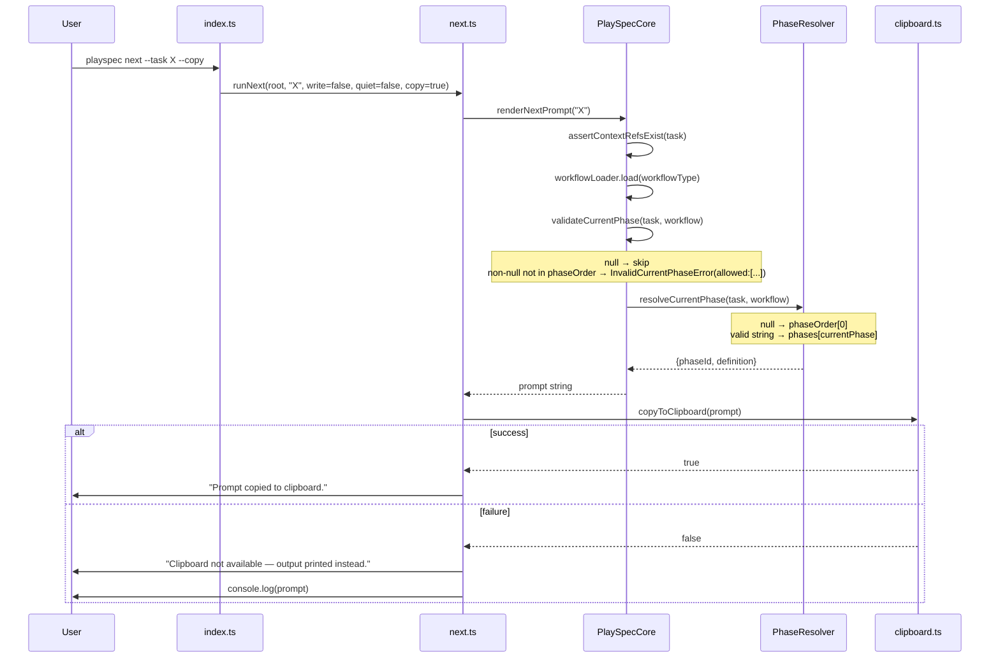
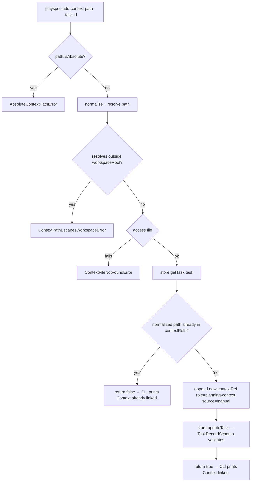

# PlaySpec UX Hotfix — Implementation Summary

---

## How to Read This Implementation Summary

**Implemented behavior:** All seven spec items are fully wired end-to-end:
- Four new CLI commands (`list-tasks`, `current-task`, `get-task`, `add-context`) are registered and callable.
- `playspec next --copy` copies the rendered prompt to clipboard with a fallback-to-print path.
- Phase validation (`InvalidCurrentPhaseError`) now lives in `PlaySpecCore` and lists allowed values.
- `PlaySpecCore.addContextRef()` handles all path validation, deduplication, and mutation — the CLI handler calls Core, not the store directly.

**Verified coverage status:** All 9 top-level spec items are **done** after two fixes applied post-verifier (hint text for `TaskNotFoundError`, normalized-path deduplication in `addContextRef`).

**Intentionally untouched areas:**
- `PhaseResolver` — no changes; spec explicitly required the validation guard to live in Core only.
- `playspec list` and `playspec current` — left as-is; the new commands are additive, not replacements.
- MCP adapter — inherits `validateCurrentPhase` and `addContextRef` automatically through `PlaySpecCore`.
- `TaskStore` interface — no new interface methods added; `addContextRef` routes through existing `updateTask`.

---

## Before vs After Summary

| Area | Before | After | Why changed |
|---|---|---|---|
| Task listing | `playspec list` — minimal, no workflowType | `playspec list-tasks` — workflowType, phase state, `INVALID(x)` warning | User couldn't see workflow type; invalid phases were invisible |
| Current task | `playspec current` — 5-field, no phase title or context count | `playspec current-task` — adds resolved phase title, contextRefs count | User needed richer status without opening YAML |
| Specific task | No command | `playspec get-task --task <id>` — direct lookup, no HEAD fallback | User had no way to inspect a non-HEAD task |
| Context addition | Manual YAML edit | `playspec add-context <file> --task <id>` via Core | Unsafe; bypassed validation; required file editing |
| Prompt copy | Manual terminal select | `playspec next --copy` — clipboard write, prints confirmation | UX friction for LLM workflow |
| Invalid phase error | `PhaseNotFoundError` — no allowed values, from PhaseResolver | `InvalidCurrentPhaseError` from Core guard — lists phaseOrder values | Users saw unhelpful "Phase X not found" with no recovery hint |
| `TaskSummary` shape | `id, title, status, currentPhase` | + `workflowType` | Required to display workflow in `list-tasks` without loading full task |

---

## Changed Files

| File | Change type | Summary |
|---|---|---|
| `src/core/errors.ts` | Extend | Added `InvalidCurrentPhaseError`, `AbsoluteContextPathError`, `ContextPathEscapesWorkspaceError`, `ContextFileNotFoundError`; updated `TaskNotFoundError` hint to reference `list-tasks` |
| `src/core/types.ts` | Extend | Added `workflowType: WorkflowType` to `TaskSummary` |
| `src/core/schemas.ts` | Extend | Added `workflowType: z.string()` to `TaskSummarySchema` |
| `src/storage/yaml-task-store.ts` | Extend | Added `workflowType` to summary objects in `listActiveTasks()` and `listCompletedTasks()` |
| `src/core/playspec-core.ts` | Extend | Added private `validateCurrentPhase(task, workflow)` guard; added public `addContextRef(taskId, contextPath)` method; imported 3 new error classes and `TaskContextRef` type |
| `src/cli/commands/next.ts` | Extend | Added `copy` parameter; clipboard write with fallback after render |
| `src/cli/commands/list-tasks.ts` | New | `runListTasks()` — active tasks with workflowType, phase display, invalid-phase warning |
| `src/cli/commands/current-task.ts` | New | `runCurrentTask()` — HEAD task with resolved phase title and contextRefs count |
| `src/cli/commands/get-task.ts` | New | `runGetTask(workspaceRoot, taskId)` — direct store lookup, no HEAD fallback |
| `src/cli/commands/add-context.ts` | New | `runAddContext()` — calls `core.addContextRef()`; prints "Context linked." or "Context already linked." |
| `src/cli/index.ts` | Extend | Registered `list-tasks`, `current-task`, `get-task`, `add-context`; added `--copy` to `next` |
| `src/utils/clipboard.ts` | New | `copyToClipboard(text)` — thin wrapper around `clipboardy.write()`, returns boolean |
| `package.json` | Extend | Added `clipboardy: "^5.3.1"` dependency |

---

## Changed Functions/Classes

| Symbol | File | Change |
|---|---|---|
| `TaskNotFoundError` | `src/core/errors.ts` | Hint updated: `playspec list` → `playspec list-tasks` |
| `InvalidCurrentPhaseError` (new) | `src/core/errors.ts` | Constructor: `(phaseId, workflowId, allowedValues[])` |
| `AbsoluteContextPathError` (new) | `src/core/errors.ts` | Thrown when `contextPath` is absolute |
| `ContextPathEscapesWorkspaceError` (new) | `src/core/errors.ts` | Thrown when path resolves outside workspace root |
| `ContextFileNotFoundError` (new) | `src/core/errors.ts` | Thrown when file does not exist at path |
| `TaskSummary` | `src/core/types.ts` | Added `workflowType: WorkflowType` field |
| `TaskSummarySchema` | `src/core/schemas.ts` | Added `workflowType: z.string()` field |
| `YamlTaskStore.listActiveTasks` | `src/storage/yaml-task-store.ts` | Populates `workflowType` in summary |
| `YamlTaskStore.listCompletedTasks` | `src/storage/yaml-task-store.ts` | Populates `workflowType` in summary |
| `PlaySpecCore.renderNextPrompt` | `src/core/playspec-core.ts` | Calls `this.validateCurrentPhase(task, workflow)` before `phaseResolver.resolveCurrentPhase()` |
| `PlaySpecCore.validateCurrentPhase` (new) | `src/core/playspec-core.ts` | Private guard: throws `InvalidCurrentPhaseError` if `task.currentPhase` is non-null and not in `workflow.phaseOrder` |
| `PlaySpecCore.addContextRef` (new) | `src/core/playspec-core.ts` | Public method: validates path (absolute, escape, existence), normalizes, deduplicates, calls `store.updateTask()` |
| `runNext` | `src/cli/commands/next.ts` | Added `copy?: boolean` param; clipboard branch after render |
| `runListTasks` (new) | `src/cli/commands/list-tasks.ts` | Lists active tasks with workflowType and invalid-phase detection |
| `runCurrentTask` (new) | `src/cli/commands/current-task.ts` | Shows HEAD task with resolved phase title and contextRefs count |
| `runGetTask` (new) | `src/cli/commands/get-task.ts` | Direct store lookup by taskId, no HEAD fallback |
| `runAddContext` (new) | `src/cli/commands/add-context.ts` | Calls `core.addContextRef()`; prints result |
| `copyToClipboard` (new) | `src/utils/clipboard.ts` | Async clipboard write with boolean return |

---

## Spec-to-Code Mapping

| Spec item (§) | Code location |
|---|---|
| §9.1 `list-tasks.ts` | `src/cli/commands/list-tasks.ts:runListTasks` → registered `src/cli/index.ts:list-tasks` |
| §9.1 `current-task.ts` | `src/cli/commands/current-task.ts:runCurrentTask` → registered `src/cli/index.ts:current-task` |
| §9.1 `get-task.ts` | `src/cli/commands/get-task.ts:runGetTask` → registered `src/cli/index.ts:get-task --task (required)` |
| §9.1 `add-context.ts` | `src/cli/commands/add-context.ts:runAddContext` → registered `src/cli/index.ts:add-context --task (required)` |
| §9.2 `next --copy` | `src/cli/commands/next.ts:runNext` copy branch; `src/utils/clipboard.ts:copyToClipboard` |
| §9.3 `validateCurrentPhase` guard in Core | `src/core/playspec-core.ts:validateCurrentPhase` (private) called in `renderNextPrompt` |
| §9.3 `InvalidCurrentPhaseError` | `src/core/errors.ts:InvalidCurrentPhaseError` |
| §9.4 `addContextRef` in Core | `src/core/playspec-core.ts:addContextRef` (public) |
| §9.4 path validation errors | `src/core/errors.ts:AbsoluteContextPathError`, `ContextPathEscapesWorkspaceError`, `ContextFileNotFoundError` |
| §9.5 `TaskSummary` + `TaskSummarySchema` workflowType | `src/core/types.ts:TaskSummary`, `src/core/schemas.ts:TaskSummarySchema`, `src/storage/yaml-task-store.ts:listActiveTasks/listCompletedTasks` |
| §8 P7 invalid-phase warning | `src/cli/commands/list-tasks.ts:runListTasks` — loads workflow per task, renders `INVALID (x)` |

---

## Active Entry Points — Migration Status

| Entry point | Before | After | Status |
|---|---|---|---|
| `playspec list` | Partial — no workflowType | Unchanged — left as-is | Left as-is per spec |
| `playspec list-tasks` | Missing | Registered → `runListTasks()` | Done |
| `playspec current` | Partial — no phase title or contextRefs count | Unchanged — left as-is | Left as-is per spec |
| `playspec current-task` | Missing | Registered → `runCurrentTask()` | Done |
| `playspec get-task --task <id>` | Missing | Registered → `runGetTask()` — `--task` required | Done |
| `playspec add-context <file> --task <id>` | Missing | Registered → `runAddContext()` → `core.addContextRef()` | Done |
| `playspec next --copy` | `--copy` undeclared (silently ignored) | `--copy` declared; clipboard write + fallback | Done |
| Phase validation (invalid non-null) | `PhaseNotFoundError` from PhaseResolver, no allowed values | `InvalidCurrentPhaseError` from Core guard with `phaseOrder` listed | Done |
| Context validation in rendering | Done — `assertContextRefsExist` shared | Unchanged | Done (already done) |
| MCP `renderNextPrompt` | Shared Core path | Inherits `validateCurrentPhase` guard automatically | Done (inherited) |

---

## Runtime Flow Diagrams

### Main render path with phase validation and clipboard

### add-context validation and mutation flow

