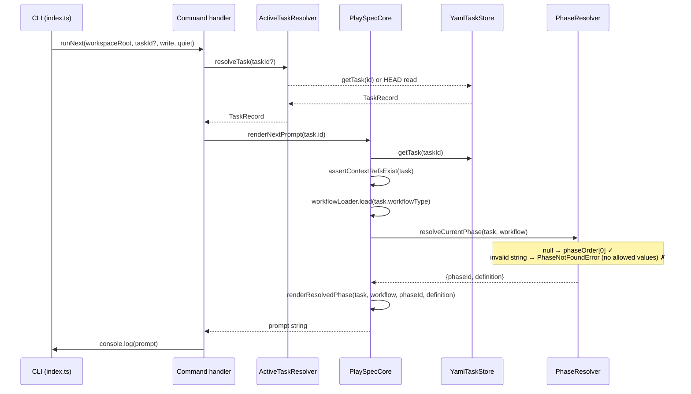
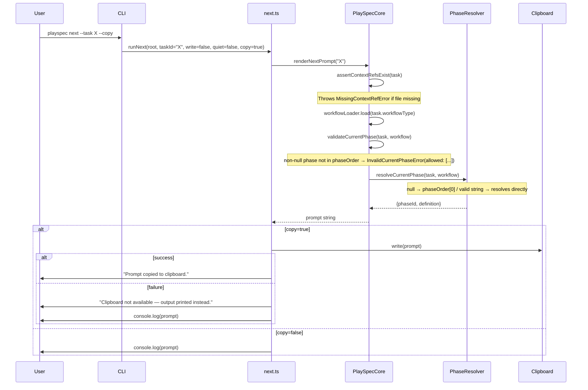
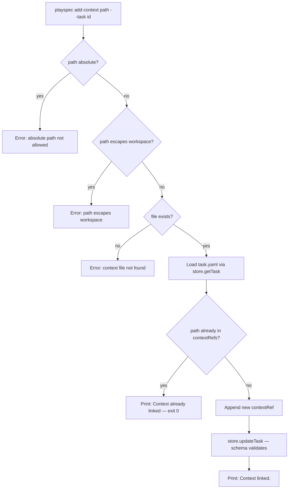

# PlaySpec UX Hotfix — Initial Technical Spec

---

## How to Read This Spec

- **Verified from code** — confirmed by reading the actual source files.
- **Inferred but not fully verified** — likely true based on code structure; needs a runtime test to confirm.
- **Proposed direction** — what the spec says must change; not yet in code.
- **Open questions** — unresolved before implementation.

---

## 1. Scope

This spec covers the UX hotfix described in the feature brief:

1. `playspec list-tasks` — rich task listing
2. `playspec current-task` — current task summary from HEAD
3. `playspec get-task --task <id>` — specific task lookup, no HEAD fallback
4. `playspec add-context <file> --task <id>` — safe contextRef addition
5. `playspec next --copy` — clipboard copy of rendered prompt
6. Phase validation: invalid non-null `currentPhase` must fail with allowed values listed
7. Context validation during rendering — already in Core; verify it applies to all paths

**Out of scope:** archive listing, task filtering/sorting, viewer UI, MCP changes, workflow redesign, migration architecture.

---

## 2. Use Case Alignment

### 2.1 Current user-facing problems

| Problem | Current state |
|---|---|
| Task discovery | User must run `ls .playspec/tasks/active/` or `playspec list` (minimal output, wrong command name vs spec) |
| Adding context | User must manually edit `task.yaml` |
| Inspecting a specific task | No direct command; `playspec current` only reads HEAD |
| Copying a rendered prompt | User must manually select/copy terminal output |
| Invalid phase detection | `currentPhase: spec_review` throws `PhaseNotFoundError` without listing allowed values |

### 2.2 Intended user-facing behavior after hotfix

The user can do their full workflow without any filesystem commands or manual YAML editing:

```
playspec create multi-spec "Migration System Bugfix"
playspec add-context docs/migration_spec.md --task migration_system_bugfix
playspec next --task migration_system_bugfix --copy
```

### 2.3 Main scenarios

| Scenario | Expected behavior |
|---|---|
| `playspec list-tasks` (main) | Lists active tasks with taskId, title, workflowType, phase state |
| `playspec current-task` | Shows current HEAD task with resolved phase title and contextRefs count |
| `playspec get-task --task <id>` (main) | Prints specific task; fails clearly if not found, no HEAD fallback |
| `playspec get-task` missing task | Error: "Task not found: X" + hint to run `list-tasks` |
| `playspec add-context` (main) | Validates path, deduplicates, writes contextRef to task.yaml via Core |
| `playspec add-context` duplicate | "Context already linked." — exits 0, no duplicate |
| `playspec add-context` absolute path | Error: absolute paths not allowed |
| `playspec add-context` path escape | Error: path escapes workspace |
| `playspec add-context` missing file | Error: context file not found |
| `playspec next --copy` | Renders prompt, copies to clipboard, prints confirmation |
| `playspec next --copy` clipboard failure | Falls back to printing normally |
| `currentPhase: null` + `playspec next` | Resolves to `phaseOrder[0]`, no mutation |
| `currentPhase: spec_review` + `playspec next` | Error with allowed values listed |
| `phaseOrder: []` + `playspec next` | Error: workflow has no phases |

---

## 3. High-Level Summary: Current Implementation vs Proposed Direction

### What is already implemented (verified)

| Feature area | Status |
|---|---|
| `currentPhase: null` → first phase resolution | **Done** — `PhaseResolver.resolveCurrentPhase()` handles this correctly at lines 13–23 |
| Context validation before rendering | **Done** — `PlaySpecCore.assertContextRefsExist()` runs in both `renderNextPrompt` and `renderExplicitPhasePrompt` |
| `playspec list` (similar to `list-tasks`) | **Partial** — exists but named `list`, minimal output (no `workflowType`) |
| `playspec current` (similar to `current-task`) | **Partial** — exists but named `current`, no phase title or contextRefs count |
| `YamlTaskStore.updateTask()` | **Done** — can be used by `addContextRef` in Core to patch `contextRefs` |

### What is missing (verified gaps)

| Feature area | Status |
|---|---|
| `playspec list-tasks` command | **Missing** — `list` exists but is not named `list-tasks` and lacks `workflowType` |
| `playspec current-task` command | **Missing** — `current` exists but is not named `current-task` and lacks resolved phase title and contextRefs count |
| `playspec get-task --task <id>` command | **Missing** — no command; `current` falls back to HEAD when `--task` is omitted |
| `playspec add-context` command | **Missing** — no command file, no Core method |
| `PlaySpecCore.addContextRef()` method | **Missing** — required; CLI must not call `store.updateTask()` directly |
| `PlaySpecCore.validateCurrentPhase()` guard | **Missing** — required; phase UX validation must live in Core, not PhaseResolver |
| `playspec next --copy` flag | **Missing** — `next` has `--write` and `--quiet` but not `--copy` |
| Phase validation error with allowed values | **Partial** — `PhaseNotFoundError` is thrown but does not list `phaseOrder` allowed values |
| `TaskSummary` includes `workflowType` | **Missing** — `TaskSummary` type and `listActiveTasks()` return only id/title/status/currentPhase |
| `TaskSummarySchema` includes `workflowType` | **Missing** — `TaskSummarySchema` in `schemas.ts` also lacks the field |

---

## 4. Relevant Files Reviewed

### Must-read (all verified)

| File | Role |
|---|---|
| `src/cli/index.ts` | CLI entry point; all commands registered here |
| `src/cli/commands/next.ts` | `runNext()` — render path; needs `--copy` flag |
| `src/cli/commands/list.ts` | `runList()` — existing analog to `list-tasks` |
| `src/cli/commands/current.ts` | `runCurrent()` — existing analog to `current-task` |
| `src/core/playspec-core.ts` | `renderNextPrompt`, `assertContextRefsExist`, full render pipeline |
| `src/workflow/phase-resolver.ts` | `resolveCurrentPhase`, `resolveExplicitPhase`, `resolveNextPhase` |
| `src/storage/yaml-task-store.ts` | `getTask`, `updateTask`, `saveTask`, `listActiveTasks` |

### Maybe-read (verified for context)

| File | Role |
|---|---|
| `src/core/errors.ts` | All error classes; `PhaseNotFoundError`, `MissingContextRefError` |
| `src/core/types.ts` | `TaskRecord`, `TaskContextRef`, `TaskSummary`, `CreateTaskInput` |
| `src/core/active-task-resolver.ts` | `resolveTask(taskId?)` — HEAD vs explicit task |
| `src/core/schemas.ts` | `TaskContextRefSchema`, `TaskRecordSchema`, `TaskSummarySchema` — validates after mutation |
| `src/storage/task-store.ts` | `TaskStore` interface |
| `src/utils/paths.ts` | `getTaskRoot`, `getHeadPath`, etc. |

---

## 5. Active Entry Points and Possible Bypasses

| Entry point | Current behavior | Status |
|---|---|---|
| `playspec list` | Lists active tasks, minimal output (no workflowType) | Partial — wrong command name, insufficient output |
| `playspec current` | Shows current HEAD task, minimal output | Partial — wrong command name, no phase title, no contextRefs count |
| `playspec list-tasks` | Not registered | Missing |
| `playspec current-task` | Not registered | Missing |
| `playspec get-task --task <id>` | Not registered | Missing |
| `playspec add-context <file> --task <id>` | Not registered | Missing |
| `playspec next --copy` | `--copy` not declared in Commander; silently ignored | Missing |
| Phase validation in `resolveCurrentPhase` | `null` → first phase (correct); invalid string → `PhaseNotFoundError` without allowed values | Partial |
| Context validation in rendering | `assertContextRefsExist` runs before render in `renderNextPrompt` and `renderExplicitPhasePrompt` | Done |

**Possible bypass:** `MCP renderNextPrompt` also calls `PlaySpecCore.renderNextPrompt()` which calls `assertContextRefsExist`. Context validation is shared. Phase validation gap (no allowed values listed) would also affect MCP path, and will be fixed automatically when the Core guard is added.

---

## 6. Current Architecture Summary



---

## 7. Verified Behavior and Constraints

### 7.1 Phase resolution (verified)

- `PhaseResolver.resolveCurrentPhase()` correctly handles `currentPhase === null` → returns `phaseOrder[0]` definition (lines 13–23, `phase-resolver.ts`).
- `currentPhase === null` with empty `phaseOrder` → throws `PhaseNotFoundError('(first)', workflow.id)` — correct.
- Invalid non-null `currentPhase` (e.g. `"spec_review"`) → falls through to `resolveExplicitPhase()` → `PhaseNotFoundError("spec_review", workflowId)`. The error message says `Phase "spec_review" not found in workflow "multi-spec"` with hint `Use playspec next to advance...` — **does not list allowed values**.

### 7.2 Context validation (verified)

- `PlaySpecCore.assertContextRefsExist()` validates:
  - Rejects absolute paths (`path.isAbsolute(ref.path)`)
  - Rejects paths that escape workspace (`!resolved.startsWith(...)`)
  - Checks file exists (`access(resolved)`)
  - All failures throw `MissingContextRefError(ref.path)` — consistent error type
- Called in `renderNextPrompt` (line 63) and `renderExplicitPhasePrompt` (line 71).
- **Confirmed shared path**: MCP adapter calls the same `PlaySpecCore` methods.

### 7.3 TaskStore (verified)

- `updateTask(taskId, patch)` does a shallow merge of `patch` onto existing record, sets `updatedAt`, then calls `saveTask()` which runs `TaskRecordSchema.parse()` before writing.
- `TaskContextRefSchema`: `role: z.literal('planning-context')`, `source: z.string()` — `source: 'manual'` is valid at both type and schema level (since `TaskId = string`).
- `listActiveTasks()` returns `TaskSummary[]` which lacks `workflowType`.
- `TaskSummarySchema` (`schemas.ts:70–75`) also lacks `workflowType` — must be updated alongside the type.

### 7.4 Command registration (verified)

- `src/cli/index.ts` registers: `init`, `create`, `list`, `current`, `use`, `next`, `phase`, `complete`, `status`, `evidence`, `snapshot`, `desync-check`, `rollback`, `migrate`.
- No `list-tasks`, `current-task`, `get-task`, `add-context` registered.
- `next` command in `index.ts` declares `--task`, `--write`, `--quiet` — no `--copy`.

---

## 8. Problems in Current Design

### P1: Command naming mismatch
Spec calls for `list-tasks`, `current-task`, `get-task`; existing commands are `list` and `current`. They are **not aliases** — different output format expected.

### P2: `get-task` does not exist
No command to look up a specific task without touching HEAD.

### P3: `add-context` does not exist
No CLI surface, no Core method, no validation logic for manual contextRef addition.

### P4: `--copy` flag missing from `next`
`runNext` signature is `(workspaceRoot, taskId?, write, quiet)` — no `copy` parameter.

### P5: Phase validation error lacks allowed values
`PhaseNotFoundError` constructor takes `(phaseId, workflowId)` — the `phaseOrder` array is not included in the message. Users see `Phase "spec_review" not found` with no hint about valid IDs.

### P6: `TaskSummary` lacks `workflowType`
`listActiveTasks()` returns summaries without `workflowType`. `list-tasks` needs it. Extend both `TaskSummary` type and `TaskSummarySchema`.

### P7: `list-tasks` phase display needs invalid-phase warning
When `currentPhase` is a string not in `phaseOrder`, the list should show `INVALID (spec_review)`. This requires loading the workflow per task in the listing, which is heavier.

---

## 9. Proposed Implementation Direction

### 9.1 New command files (add to `src/cli/commands/`)

| File | Purpose |
|---|---|
| `list-tasks.ts` | `runListTasks()` — calls `store.listActiveTasks()`, displays with workflowType; optionally load full task for workflowType |
| `current-task.ts` | `runCurrentTask()` — uses `ActiveTaskResolver`, shows resolved phase title, contextRefs count |
| `get-task.ts` | `runGetTask(workspaceRoot, taskId)` — requires `--task`; calls `store.getTask()` directly, no HEAD fallback |
| `add-context.ts` | `runAddContext(workspaceRoot, filePath, taskId)` — calls `core.addContextRef()`; path validation and dedup handled in Core |

### 9.2 Extend `next.ts`

Add `copy?: boolean` parameter to `runNext()`. After rendering prompt, if `copy`, attempt clipboard write. On failure, print warning and continue to `console.log(prompt)`.

**Clipboard library:** use `clipboardy` (ESM-compatible) or fall back to a `pbcopy`/`xclip`/`clip.exe` shell call. Prefer `clipboardy` since the project already uses Node ESM.

### 9.3 Fix phase validation error message

The validation guard must live in `PlaySpecCore`, not in `PhaseResolver`. `PhaseResolver` is a pure resolver — its responsibility ends at resolution; UX-level error message construction belongs in Core.

**Implementation:** Add a private `validateCurrentPhase(task, workflow)` method to `PlaySpecCore`. Call it in `renderNextPrompt()` after loading the workflow, immediately before calling `phaseResolver.resolveCurrentPhase()`. If `task.currentPhase` is non-null and not present in `workflow.phaseOrder`, throw `InvalidCurrentPhaseError(task.currentPhase, workflow.id, workflow.phaseOrder)`.

`PhaseResolver.resolveCurrentPhase()` requires no changes.

Add `InvalidCurrentPhaseError(phaseId, workflowId, allowedValues)` class to `errors.ts`.

### 9.4 `add-context` path validation

`runAddContext()` must call `PlaySpecCore.addContextRef(taskId, contextPath)`. All path validation, deduplication, and mutation happen inside Core. Direct access to `store.updateTask()` from the CLI handler is forbidden for this path — it would bypass validation centralization and break MCP reusability.

The following validation rules apply (implemented inside `PlaySpecCore.addContextRef()`):
- Reject absolute paths
- Reject paths with `../` traversal that escape workspace
- File must exist
- Path must be workspace-relative
- Deduplicate by normalized path

`PlaySpecCore.assertContextRefsExist()` already uses the same path normalization pattern — `addContextRef()` can reuse that logic internally.

### 9.5 `list-tasks` workflowType

`TaskSummary` does not include `workflowType`. Extend both `TaskSummary` (in `types.ts`) and `TaskSummarySchema` (in `schemas.ts`) to add `workflowType: string`, then update `listActiveTasks()` and `listCompletedTasks()` in `yaml-task-store.ts` to populate it.

### 9.6 Register new commands in `src/cli/index.ts`

Add Commander command registrations for:
- `list-tasks`
- `current-task`
- `get-task --task <id>`
- `add-context <file> --task <id>`
- `next --copy` (extend existing)

---

## 10. File-by-File Change Plan

| File | Change type | Details |
|---|---|---|
| `src/cli/index.ts` | Extend | Register `list-tasks`, `current-task`, `get-task`, `add-context`; add `--copy` to `next` |
| `src/cli/commands/next.ts` | Extend | Add `copy` param; attempt clipboard write after render; fallback to print |
| `src/cli/commands/list-tasks.ts` | New | `runListTasks()` |
| `src/cli/commands/current-task.ts` | New | `runCurrentTask()` — resolves phase title via workflow loader |
| `src/cli/commands/get-task.ts` | New | `runGetTask(workspaceRoot, taskId)` — no HEAD fallback |
| `src/cli/commands/add-context.ts` | New | `runAddContext()` — calls `core.addContextRef()`; validation and dedup handled in Core |
| `src/core/playspec-core.ts` | Extend | Add private `validateCurrentPhase(task, workflow)` guard called in `renderNextPrompt()` before `phaseResolver.resolveCurrentPhase()`; add public `addContextRef(taskId, contextPath)` method |
| `src/core/errors.ts` | Extend | Add `InvalidCurrentPhaseError(phaseId, workflowId, allowedValues)` |
| `src/core/types.ts` | Extend | Add `workflowType: string` to `TaskSummary` |
| `src/core/schemas.ts` | Extend | Add `workflowType: z.string()` to `TaskSummarySchema` |
| `src/storage/yaml-task-store.ts` | Extend | Add `workflowType` to returned `TaskSummary` in `listActiveTasks()` and `listCompletedTasks()` |
| `src/utils/clipboard.ts` | New (optional) | Thin wrapper around `clipboardy` with fallback |
| `package.json` | Extend | Add `clipboardy` dependency |

---

## 11. Risks and Open Questions

### R1: `clipboardy` in ESM context
The project uses `"type": "module"`. `clipboardy` v4+ is ESM-only — should be compatible. **Verify**: check that `clipboardy` v4+ is available and that no bundler restrictions apply before adding.

### R2: Extending `TaskSummary` is a breaking interface change
Adding `workflowType` to `TaskSummary` and `TaskSummarySchema` is additive and safe. All usages of `TaskSummary` are internal (`task-store.ts`, `yaml-task-store.ts`). **Verify**: grep for `TaskSummary` before changing to confirm no external consumers are affected.

### R3: `list-tasks` invalid phase warning requires workflow load per task
Loading a workflow per task in `list-tasks` is heavier. Since this is a CLI convenience command and task counts are expected to be small, this is acceptable. If it becomes slow, add a lazy-load path later.

### Q1: Should `list-tasks` show completed tasks too, or only active?
Spec says "active tasks" — use `listActiveTasks()`.

---

## 12. Reader Aids

### Current implementation vs proposed direction

| Area | Current | Proposed |
|---|---|---|
| Task listing | `playspec list` — minimal, no workflowType | `playspec list-tasks` — includes workflowType, phase state, invalid-phase warning |
| Current task | `playspec current` — 5-field summary | `playspec current-task` — adds resolved phase title, contextRefs count |
| Specific task | No command | `playspec get-task --task <id>` — direct lookup, no HEAD fallback |
| Context add | Manual YAML edit | `playspec add-context <file> --task <id>` — validated, deduplicated, via Core |
| Prompt copy | Manual terminal select | `playspec next --copy` — clipboard + fallback |
| Invalid phase error | `PhaseNotFoundError` (no allowed values) | `InvalidCurrentPhaseError` from Core guard — lists phaseOrder allowed values |

### What is already implemented vs what still needs verification

| Claim | Confidence |
|---|---|
| `currentPhase: null` → `phaseOrder[0]` works in `renderNextPrompt` | **Verified** |
| Context validation runs before render in `renderNextPrompt` | **Verified** |
| `updateTask` is safe for contextRef patching (schema validates after) | **Verified** |
| `clipboardy` is ESM-compatible with this project setup | **Not yet verified** — check package.json before adding |
| No test coverage for `--copy` flag | **Inferred** (not in codebase) |
| `MCP renderNextPrompt` hits same context validation path | **Verified** — shares `PlaySpecCore` |

### Render path flow with proposed changes



### `add-context` validation flow

The following shows the internal logic of `PlaySpecCore.addContextRef(taskId, contextPath)`, called by `runAddContext()`:


