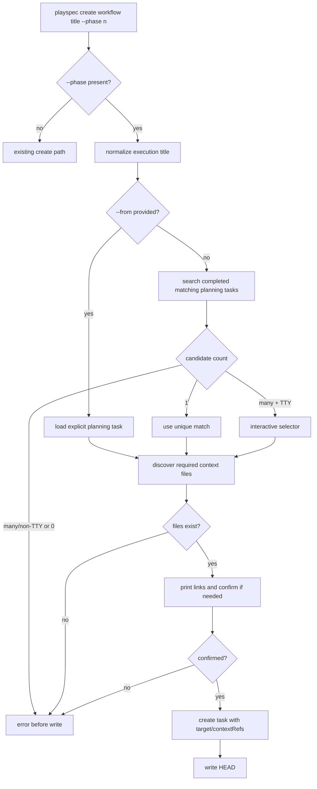
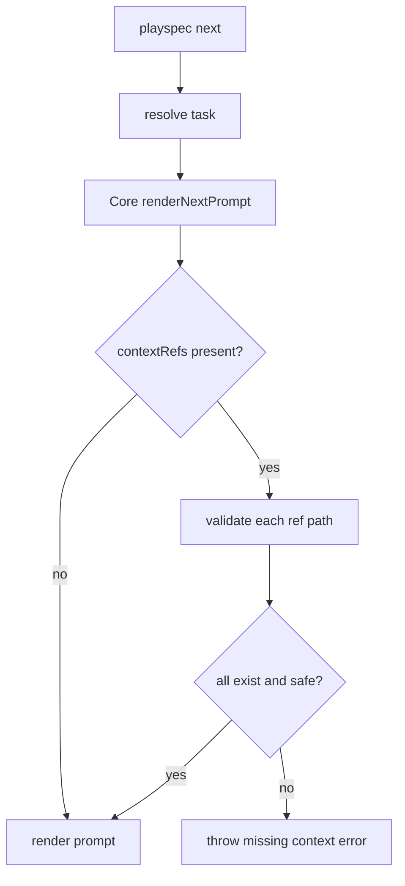

# PlaySpec Phase 3.6 Implementation Spec

## 1. How to read this spec

This is a first-draft, implementation-ready technical spec for Dev Phase `3.6` only.

Treat `docs/playspec_total_spec.md` as architecture truth and `docs/playspec_phase_plan.md` as phase-boundary truth. This phase is limited to Task Relay and Smart Context Binding from a completed Planning Task into a newly created Execution Task.

This phase must not introduce `project.yaml`, Project/Stage hierarchy, DAG execution, automatic next-task spawning, MCP behavior, archive behavior, viewer behavior, conditional routing, or result-based loops.

The core safety rule is that `task.yaml` remains the source of truth for the new execution task's `target` and `contextRefs`. `contextRefs` are references to files, not workflow state and not task execution dependencies.

## 2. Phase boundary alignment

### Locked Phase 3.6 goal

Provide a clear, confirmable relay from a completed Planning Task to a new Execution Task.

The primary user flow is:

```bash
playspec create phase-execution "Login System" --phase 1
playspec create phase-execution "Login System" --phase 1 --from login_system
```

The created task should be named `Login System Phase 1 Execution`, store `target.phaseNumber`, bind planning context files into `contextRefs`, print the linked files, and require user confirmation when the bind is interactive/automatic.

### Why this phase exists

Before this phase, planning work and implementation work are disconnected. The user can create tasks and render prompts, but implementation tasks do not automatically know which total spec or phase plan they are supposed to use.

Phase `3.6` closes that gap without creating a project hierarchy. It links one execution task to planning context files through explicit task YAML references.

### In scope

- `playspec create <workflow> "<title>" --phase <n>`
- `--from <TASK_ID>` as explicit planning source, with highest priority.
- `phase-execution` as a real default workflow id, backed by a preset workflow file.
- `phase-execution` flow activation when `--phase` is supplied.
- Final execution title normalization:
  - input title `Login System`
  - phase `1`
  - final title `Login System Phase 1 Execution`
  - do not duplicate an existing `Phase N` suffix.
  - do not duplicate an existing `Execution` suffix.
- Persist `target.phaseNumber` in `task.yaml`.
- Persist `contextRefs` in `task.yaml`.
- Discover completed Planning Context / Master Task candidates by title match.
- Bind the selected/computed planning task's feature-scoped master spec and phase plan file references from its `paths.projectDocRoot`.
- Binding priority:
  - `--from TASK_ID`
  - unique completed title match
  - interactive selector for multiple candidates
  - error for non-interactive ambiguity or missing required context
- Print linked context files before finalizing interactive confirmation and in the successful create output.
- Require one-time confirmation before finalizing interactive auto-binding.
- Reject `playspec next` when any persisted `contextRefs[].path` is missing.
- Keep `contextRefs` as references, not workflow state.

### Out of scope

- `project.yaml` or Project/Stage state.
- DAG execution.
- Automatic creation/spawning of execution tasks from planning tasks.
- Guessing between multiple candidate planning tasks.
- Conditional routing or loop guards from Phase `3.7`.
- MCP-driven context migration from Phase `4.1`.
- Archive, viewer, evolution, retry/harness, or task close behavior.
- Template redesign to embed full referenced files into prompts, unless already required by an existing template.

### Dependencies

- Phase `1.x` task creation, active task resolution, workflow loading, phase resolving, and prompt rendering.
- Phase `2` completion can mark planning tasks completed.
- Phase `3.5` compact header can later display `target` and context counts once the schema supports them, but display is secondary to this phase.
- `task.yaml` remains the single persisted state record for each task.

### What must be complete before the next phase can safely begin

- `create --phase` and `create --phase --from` work through the real CLI command.
- The default preset contains a loadable `phase-execution` workflow whose `id` is `phase-execution`.
- Created execution tasks persist `target.phaseNumber` and `contextRefs` through schema parse/save cycles.
- Candidate discovery can inspect completed tasks, not only active tasks.
- Non-interactive create does not guess when `--from` is absent and the source is not deterministic.
- Interactive create does not finalize auto-linked context without confirmation.
- `next` refuses to render when any stored context ref path is missing.
- Existing plain `playspec create <workflow> "<title>"` behavior remains intact.
- No new project-level state, DAG, or automatic task spawning is introduced.

### Visible capability introduced

After this phase, a reviewer can create a phase execution task from an existing completed planning task and see:

- a normalized execution task title,
- `target.phaseNumber` in `task.yaml`,
- `contextRefs` for the planning total spec and phase plan,
- explicit CLI output showing the links,
- a render-time guard if a linked context file disappears.

### What would make this phase unsafe even if partially implemented

- `target` and `contextRefs` are added to interfaces but stripped by `TaskRecordSchema`.
- `create --phase` creates a task before ambiguity/confirmation is resolved, leaving orphaned or partially bound tasks on cancellation.
- `--from` points to an active or unrelated task and is accepted without checking completion/context files.
- Unique matching searches only active tasks, so completed planning tasks are never found.
- `next` validates context refs in CLI only while direct `PlaySpecCore.renderNextPrompt()` bypasses the missing-file guard.
- Multiple candidates are silently resolved by filesystem order or first match.
- Context paths are absolute, workspace-specific, or outside the workspace.

## 3. Phase Outcome at a Glance

### After this phase, you can

- Run `playspec create phase-execution "Login System" --phase 1 --from login_system`.
- Create `Login System Phase 1 Execution` without manually typing that full title.
- Persist the target workflow phase on the execution task.
- Persist planning context file references on the execution task.
- Let PlaySpec find a unique completed planning task by title.
- Choose a planning task interactively when multiple matches exist.
- See exactly which context files were linked.
- Block prompt rendering when a linked context file is missing.

### After this phase, you still cannot

- Auto-spawn execution tasks from planning completion.
- Route to another phase based on a result value.
- Build project/stage state across tasks.
- Treat `contextRefs` as task execution dependencies.
- Use MCP, archive, viewer, or migration tooling for context promotion.
- Automatically select between multiple ambiguous planning tasks.

### This phase is ready to implement / hand off when

- The create CLI options and runCreate input shape are defined.
- The task schema additions are clear and round-trip through storage.
- The planning-task discovery rule is deterministic and bounded.
- The confirmation/cancellation behavior avoids partial writes.
- The `next` missing-context guard is located in Core, not only CLI.
- Test cases cover positive, ambiguous, missing-context, and old-path behaviors.

## 4. Current implementation vs proposed direction

### Verified current behavior

- `src/cli/index.ts:62` registers `create <workflowType> <title>` with no `--phase` or `--from` options.
- `src/cli/commands/create.ts:8` accepts only `workspaceRoot`, `workflowType`, and `title`.
- `src/cli/commands/create.ts:21` derives task id directly from the raw title.
- `src/cli/commands/create.ts:23` calls `YamlTaskStore.createTask({ id, title, workflowType })`.
- `src/cli/commands/create.ts:26` writes the created task id to `.playspec/HEAD`.
- `src/storage/yaml-task-store.ts:46` exposes `listActiveTasks()`, which filters out completed tasks.
- `src/storage/yaml-task-store.ts:73` creates a task with no `target` and no `contextRefs`.
- `src/core/types.ts:24` `TaskRecord` has no `target` or `contextRefs`.
- `src/core/types.ts:65` `CreateTaskInput` has only `id`, `title`, and `workflowType`.
- `src/core/schemas.ts:40` `TaskRecordSchema` has no `target` or `contextRefs`.
- `src/cli/commands/next.ts:37` calls `PlaySpecCore.renderNextPrompt()` after resolving task/header/desync behavior.
- `src/core/playspec-core.ts:53` `renderNextPrompt()` loads the task/workflow and renders without checking context refs.
- `src/template/variable-resolver.ts:25` passes task variables into templates but does not expose `target` or `contextRefs`.
- `src/cli/context-header.ts` currently shows only `Task:` and `Phase:`.

### Inferred but not fully verified points

- Zod object parsing will not preserve new YAML fields unless they are modeled in `TaskRecordSchema`; therefore `target` and `contextRefs` must be added to both TypeScript types and schemas before storage can safely persist them.
- The existing task directory model keeps all active and completed statuses under `.playspec/tasks/active/<taskId>`; completed tasks are status-marked, not moved. Discovery can likely scan that existing root, but the public `TaskStore` interface currently lacks `listTasks()` or `listCompletedTasks()`.
- Current default presets do not include a `phase-execution.yaml` workflow. Phase `3.6` must add this preset workflow instead of treating `phase-execution` as an alias for another workflow id.
- Current templates do not render linked context file contents. The locked acceptance criteria require binding and missing-file guards, not necessarily prompt inclusion. If context contents must appear in prompts, that should be called out as an explicit template/workflow addition.

### Proposed Phase 3.6 direction

Implement this as a bounded create-time relay plus a Core render-time guard:

- Extend `TaskRecord`, `TaskRecordSchema`, and `CreateTaskInput` with optional `target` and `contextRefs`.
- Keep the fields optional so existing task YAML remains loadable.
- Add `src/preset/assets/default/workflows/phase-execution.yaml` with `id: phase-execution`; reuse the existing linear execution prompt shape unless implementation discovers a concrete reason for a separate template.
- Add `--phase <n>` and `--from <taskId>` to `playspec create`.
- Change `runCreate()` to accept an options object and keep CLI-specific prompt/TTY handling there.
- Move normalized create planning and confirmed task persistence behind a Core-level create method or equivalent Core-owned service so future adapters do not duplicate the same relay rules.
- Preserve old create behavior when `--phase` is absent.
- When `--phase` is present:
  - normalize the execution title,
  - derive task id from the normalized title,
  - resolve planning context according to the priority rules,
  - validate required context files before writing the execution task,
  - ask for confirmation in interactive auto-bind paths before writing,
  - create the task with `target` and `contextRefs`,
  - write HEAD after successful creation only,
  - print linked context paths.
- Add a bounded task-listing capability to storage so candidate discovery can inspect completed tasks.
- Add the missing-context guard in `PlaySpecCore.renderNextPrompt()` and `renderExplicitPhasePrompt()` via a shared private assertion before template rendering.
- Update `formatContextHeader()` and `status` only if `target/contextRefs` are present and supported; this is useful but not the primary completion signal.

Avoid a new relay framework. A small helper module or Core service for title normalization, planning candidate discovery, and context validation is enough if it prevents `runCreate()` from becoming the only owner of relay semantics.

## 5. Use Case Alignment for this Phase

| Use case | Current status | Phase 3.6 expected result | Observable result |
|---|---:|---|---|
| Create a normal task | enabled | unchanged | `playspec create multi-spec "Feature"` still creates `feature` and sets HEAD |
| Create execution task for a known planning task | missing | enabled through `--phase --from` | task title/id normalized, `target.phaseNumber` and two `contextRefs` saved |
| Create execution task when exactly one completed planning task matches | missing | enabled, subject to transparency/confirmation rules | CLI prints linked files and final task exists only after confirmation when interactive |
| Multiple matching planning tasks in non-interactive mode | missing | blocked | command exits with hint to pass `--from TASK_ID`; no new task is created |
| Multiple matching planning tasks in interactive TTY | missing | enabled with selector | numbered candidates shown, selected task used, confirmation required |
| Planning task lacks required context files | missing | blocked | command exits before creating execution task |
| Existing `contextRefs` point to deleted files | missing | blocked at render | `playspec next` refuses to render with a clear missing-context error |
| User inspects status/header | partial | shows target/context summary when present | `playspec status` includes `Target:`/`Context:` lines if implemented |

Do not mark the relay use case enabled unless task creation, persisted YAML, visible CLI output, and `next` guard all work together.

## 6. Relevant files reviewed

### must-read

- `docs/playspec_phase_plan.md`
- `docs/playspec_total_spec.md`
- `src/cli/index.ts`
- `src/cli/commands/create.ts`
- `src/cli/commands/next.ts`
- `src/cli/commands/status.ts`
- `src/cli/context-header.ts`
- `src/core/playspec-core.ts`
- `src/core/types.ts`
- `src/core/schemas.ts`
- `src/core/errors.ts`
- `src/storage/task-store.ts`
- `src/storage/yaml-task-store.ts`
- `src/template/variable-resolver.ts`
- `tests/cli.test.ts`
- `tests/integration/task-store.test.ts`

### maybe-read

- `src/core/active-task-resolver.ts`
- `src/workflow/workflow-loader.ts`
- `src/workflow/phase-resolver.ts`
- `src/template/template-renderer.ts`
- `src/cli/commands/list.ts`
- `src/cli/commands/current.ts`
- `src/cli/commands/use.ts`
- `src/utils/paths.ts`
- `src/utils/fs.ts`
- `src/utils/slug.ts`
- `src/preset/assets/default/workflows/multi-spec.yaml`
- `src/preset/assets/default/templates/multi-spec/phase_template.md`
- `tests/integration/init-create-next.test.ts`
- `tests/helpers/createTempWorkspace.ts`

### ignore-for-now

- `src/core/rollback-manager.ts`
- `src/core/git-state.ts`
- `src/core/state-desync-detector.ts`
- `src/cli/commands/rollback.ts`
- `src/cli/commands/evidence.ts`
- `src/cli/commands/snapshot.ts`
- MCP, archive, viewer, evolution, harness, and DAG files

## 7. Active entry points and possible bypasses

| Entry point / call site | Current behavior | Status | Why it matters to this phase |
|---|---|---:|---|
| `src/cli/index.ts` `program.command('create')` | accepts only workflow/title | missing | Must parse `--phase` and `--from` into the real create path. |
| `src/cli/commands/create.ts` `runCreate()` | creates a task directly from raw title | partial | Main relay insertion point; must preserve old create behavior and add phase execution branch. |
| `YamlTaskStore.createTask()` | persists basic task only | partial | Must persist `target` and `contextRefs` atomically with task creation. |
| `TaskRecordSchema.parse()` | strips/rejects unmodeled persisted relay fields by omission | missing | New YAML fields must round-trip safely. |
| `TaskStore.listActiveTasks()` | only returns active summaries | partial | Smart binding needs completed planning tasks, not active-only summaries. |
| `PlaySpecCore.renderNextPrompt()` | renders without context-ref validation | missing | Missing-context guard belongs here to cover CLI and future adapters. |
| `runNext()` | calls Core render after desync warning | partial | CLI-visible failure path for missing context refs. |
| `formatContextHeader()` / `runStatus()` | no target/context display | partial | Optional visibility path after fields exist; not a substitute for persistence. |

### Old-path / bypass-path risks

- Old path: `playspec create multi-spec "Title"` must continue to create a basic task with no relay behavior.
- Bypass path: `playspec phase` uses `renderExplicitPhasePrompt()` and should also respect missing context refs if the task has them, even though the phase plan names `next`.
- Bypass path: direct `PlaySpecCore.renderNextPrompt()` callers should receive the same missing-context failure as CLI callers.
- Dual path risk: context validation in `runNext()` only would leave Core/future MCP paths unguarded.
- Partial migration risk: adding `contextRefs` to `TaskRecord` but not `TaskRecordSchema` or `YamlTaskStore.createTask()` makes the field look implemented while persisted YAML loses it.
- Candidate discovery risk: relying on `listActiveTasks()` can never find completed planning tasks.

## 8. Verified behavior and constraints

- The current create command is CLI-only; Core has no task factory service.
- The task store owns task directory creation and initial `task.yaml` persistence.
- Completion marks `TaskRecord.status` as `completed` but current code still reads tasks from `.playspec/tasks/active/<taskId>`.
- Existing commands use path aliases for cross-module imports; new imports must follow that rule.
- Current schemas keep Phase 3 and Phase 3.5 metadata optional for backward compatibility. New relay fields should follow the same optional-field pattern.
- `contextRefs` paths should be relative workspace paths so task YAML remains portable.
- File existence validation should reject missing files before task creation and before prompt rendering.
- Confirmation must happen before final `task.yaml` write for interactive auto-binding, so cancellation does not leave a partially created task.

## 9. What is already implemented vs what still needs verification

### Already implemented

- Plain task creation and HEAD update.
- Active task resolution for `next`, `status`, `complete`, and `phase`.
- Prompt rendering through `PlaySpecCore`.
- Completed status after final phase.
- Compact header/status display path from Phase `3.5`.
- Storage parse/save path through Zod schemas.

### Still missing

- CLI `--phase` option.
- CLI `--from` option.
- `phase-execution` default preset workflow file.
- Execution title normalization.
- `target` and `contextRefs` TypeScript types.
- `target` and `contextRefs` Zod schemas.
- Store create/update support for relay metadata.
- Completed planning task discovery.
- Context file discovery for `<featureSlug>_total_spec.md` and `<featureSlug>_phase_plan.md`.
- Interactive selector.
- One-time confirmation.
- Non-interactive ambiguity error.
- Missing-context render guard.
- Tests for all relay paths.

### Needs implementation-time clarification

No architecture/spec-level open questions remain. Interactive confirmation/selector tests still need a small implementation-time testing approach that avoids fragile terminal behavior.

## 10. Proposed implementation direction for this phase

### Data model

Add minimal types:

```ts
export interface TaskTarget {
  phaseNumber: string;
}

export interface TaskContextRef {
  path: string;
  role: 'planning-context';
  source: TaskId;
}
```

Then extend `TaskRecord` with:

```ts
target?: TaskTarget;
contextRefs?: TaskContextRef[];
```

Extend `CreateTaskInput` with the same optional fields so task creation can persist them on first write.

Add matching Zod schemas:

- `TaskTargetSchema`
- `TaskContextRefSchema`
- optional `target`
- optional `contextRefs`

Keep fields optional for old task compatibility.

### CLI options

In `src/cli/index.ts`, extend `create`:

```ts
.option('--phase <n>', 'Target workflow phase for phase-execution tasks')
.option('--from <taskId>', 'Planning task ID to bind context from')
```

Pass an options object to `runCreate()`.

### Create behavior

`runCreate()` should branch:

- no `--phase`: existing behavior.
- with `--phase`: Phase `3.6` execution flow.

Execution flow:

1. Validate workspace initialized.
2. Normalize final title.
3. Resolve planning source:
   - use `--from` if provided,
   - otherwise search completed tasks by title,
   - if exactly one match, use it,
   - if multiple and interactive, prompt user,
   - otherwise fail with an explicit hint.
4. Discover and validate required planning context paths.
5. Print candidate linked files.
6. If interactive auto-binding requires confirmation, ask before writing.
7. Call the Core-owned create/persistence path to create the task with normalized id/title, workflow type, `target`, and `contextRefs`.
8. Set HEAD after successful task creation.
9. Print created task and linked context summary.

For `--from`, still print linked files. The phase plan says `--from` is highest priority, not silent.

Keep terminal input/output in CLI, but keep the durable creation operation Core-owned after confirmation. The key rule is that every adapter should eventually be able to create the same normalized execution task without reimplementing metadata persistence, context validation, and HEAD-safe ordering.

### Candidate discovery

Add a store method that can read all task records, or a specific `listTasks()`/`listCompletedTasks()` method. Keep it local to `YamlTaskStore`/`TaskStore`; do not introduce project state.

Candidate filter:

- `status === 'completed'`.
- title matches the base title under a simple documented rule.
- required planning context files exist.

Keep the matching conservative. If uncertain, return multiple/no candidates and require `--from`.

### Context path discovery

Required context refs are:

```yaml
contextRefs:
  - path: <planning-total-spec-path>
    role: planning-context
    source: <planning-task-id>
  - path: <planning-phase-plan-path>
    role: planning-context
    source: <planning-task-id>
```

Paths should be workspace-relative and must not be absolute.

Deterministic discovery rule:

- Resolve `featureSlug` from `planningTask.variables.FEATURE_SLUG`; if absent, use `planningTask.id`.
- Resolve the planning document root from `planningTask.paths.projectDocRoot`.
- Require exactly:
  - `<planningTask.paths.projectDocRoot>/<featureSlug>_total_spec.md`
  - `<planningTask.paths.projectDocRoot>/<featureSlug>_phase_plan.md`
- Store both paths workspace-relative in `contextRefs`.
- Do not fall back to literal `total_spec.md` / `phase_plan.md`, repo-root docs, or filesystem search.
- If either required file is absent, fail before creating the execution task.

### Missing context guard

Add a private Core assertion in the shared render path used by both:

- `renderNextPrompt()`
- `renderExplicitPhasePrompt()`

The assertion should:

- skip tasks with no `contextRefs` or an empty array,
- reject absolute paths,
- reject paths escaping the workspace,
- reject missing files,
- throw a `PlaySpecError` subclass with a recovery hint.

This makes the guard coherent for CLI now and MCP later.

### Header/status visibility

Once fields exist, update `formatContextHeader(task)` to add lines only when values are present:

- `Target: phase <phaseNumber>`
- `Context: <N> linked file(s)`

Keep the header compact. Do not read files from the header formatter.

### Tests

Add focused tests in existing suites:

- CLI create old path unchanged.
- CLI create with `--phase --from` persists normalized title, target, context refs, and HEAD.
- `--phase` title normalization avoids duplicate `Phase N` and `Execution`.
- Non-interactive multiple candidates without `--from` fails and creates no task.
- Missing planning context files fail and create no execution task.
- `next` rejects missing stored context ref path.
- Store round-trip preserves `target` and `contextRefs`.
- Existing old task YAML without those fields still loads.

Interactive selector tests may use a small injected prompt/TTY helper if needed, but avoid broad CLI framework changes.

## 11. Testable outcomes

| Test scenario | Entry point | Required setup | Expected observable result | Status | Out-of-phase failure acceptable |
|---|---|---|---|---:|---:|
| Plain create remains unchanged | `playspec create multi-spec "Feature Name"` | initialized workspace | creates `feature_name`, no `target/contextRefs`, HEAD set | testable | no |
| Explicit relay create | `playspec create phase-execution "Login System" --phase 1 --from login_system` | completed planning task with both context files | creates normalized execution task, writes target/contextRefs, prints linked files | testable | no |
| Title normalization no duplicate phase | same with title containing `Phase 1` | planning task/context files | final title has one `Phase 1` | testable | no |
| Title normalization no duplicate execution | same with title containing `Execution` | planning task/context files | final title has one `Execution` | testable | no |
| Store round-trip | `YamlTaskStore.createTask()`/`getTask()` | create with target/contextRefs | fetched task preserves fields | testable | no |
| Unique completed match | `playspec create ... --phase 1` | one completed matching planning task | selected source is linked and printed | testable if non-interactive policy allows unique match | no |
| Multiple non-interactive candidates | `playspec create ... --phase 1` | two completed matches, non-TTY | exits with `--from` hint, no task created | testable | no |
| Missing planning context | `playspec create ... --phase 1 --from source` | source completed but lacks one required file | exits before creating execution task | testable | no |
| Missing stored context at render | `playspec next` | execution task has contextRef to deleted file | render refused with clear error | testable | no |
| Reviewer demo | create planning task, mark completed, add context files, run create/next | initialized workspace | linked execution task can render until a linked file is removed | testable | no |

## 12. Example review / demo scenarios

### Demo: explicit source task

1. Initialize a workspace.
2. Create a planning task named `Login System`.
3. Mark or set that task status to `completed` through existing completion/test setup.
4. Add planning docs in the expected context location.
5. Run:

```bash
playspec create phase-execution "Login System" --phase 1 --from login_system
```

Expected:

- stdout names the created execution task,
- stdout lists the linked files,
- `.playspec/HEAD` points at `login_system_phase_1_execution`,
- `task.yaml` includes `target.phaseNumber: "1"`,
- `task.yaml` includes two `contextRefs`.

### Demo: render guard

1. Delete one linked context file.
2. Run:

```bash
playspec next
```

Expected:

- command exits non-zero,
- error states the missing context ref path,
- prompt body is not printed.

### Demo: ambiguity guard

1. Create two completed planning tasks that match `Login System`.
2. Run create without `--from` in a non-interactive process.

Expected:

- command exits non-zero,
- error asks for `--from TASK_ID`,
- no execution task directory is created.

## 13. Risks / open questions

No architecture/spec-level open questions remain.

### Medium risk: completed-task discovery API

`listActiveTasks()` filters out completed tasks. Reusing it would make smart binding appear implemented while never finding valid planning sources.

Smallest safe fix: add a store method that lists task records or completed tasks from the existing task root.

### Medium risk: CLI-only creation ownership

Task creation is currently owned entirely by `runCreate()`, including id derivation, persistence, and HEAD mutation. Phase `3.6` adds enough relay policy that implementing all of it only in CLI would create duplicate work for future adapters.

Smallest safe fix: keep selector/confirmation I/O in CLI, but put normalized task creation and persistence in Core or a Core-owned helper that CLI calls after confirmation.

### Medium risk: partial persistence

Relay metadata must be present in types, schemas, create input, create output, and save/update paths. Missing any one of these produces false-positive implementation.

Smallest safe fix: add schema/type/store tests before broad CLI tests.

### Low risk: header/status drift

After `target/contextRefs` exist, status/header can omit them or display stale logic if updated separately.

Smallest safe fix: keep display in `formatContextHeader()` and test status output only as visibility support.

## 14. Mermaid diagrams




