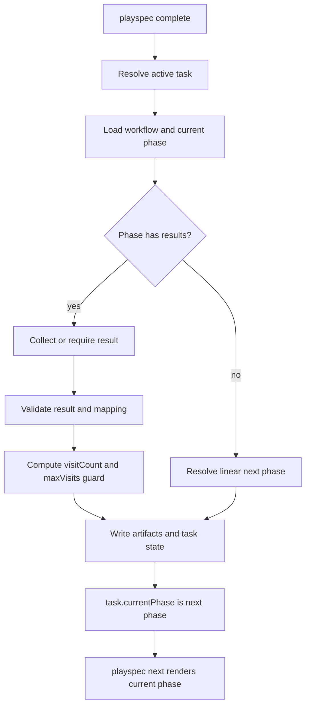

# Phase 3.7 Implementation Spec: Simple Conditional Routing with Human Selection

## 1. How to read this spec

This is an implementation-ready spec for Dev Phase 3.7 only. It is grounded in `docs/playspec_phase_plan.md` as the phase boundary source and `docs/playspec_total_spec.md` as the architecture source.

Do not use this phase to add MCP, DAG execution, automatic task spawning, automatic AI result selection, project-level state, or later workflow editing features. The implementation should stay inside the existing CLI-to-Core-to-TaskStore flow and preserve the single-task YAML model.

The central review question is:

Can a human or explicit `--result` complete a result-bearing phase, persist that result in task state, and have the next prompt move to the mapped phase with loop guard protection?

## 2. Phase boundary alignment

### Locked phase goal

Phase 3.7 enables result-based phase routing inside one task. A workflow phase may declare allowed results, result-to-next-phase mappings, and a maximum visit count. `playspec complete` captures the authoritative result, and `playspec next` follows the recorded routing decision.

### What must be complete before the next phase can safely begin

- Workflow YAML validates optional `results`, `nextByResult`, and `maxVisits` fields on phase definitions.
- `playspec complete` accepts `--result <value>`.
- For phases with `results`, completion either obtains a human-selected result interactively or requires `--result` in non-interactive execution.
- Invalid result values fail before state mutation.
- Completion records `phaseHistory[].result` and `phaseHistory[].visitCount`.
- Repeated visits to the same phase increment visit count.
- `maxVisits` prevents completing a phase past the allowed visit count.
- `playspec next` can render the routed next phase after completion by using the last completed result and `nextByResult`.
- Linear workflows without routing continue to behave as they do now.

### Intentionally deferred

- DAG execution.
- Parallel phase execution.
- Automatic next-task spawning.
- AI output parsing for result selection.
- GitHub Actions-style workflow features.
- MCP adapter behavior.
- Workflow editing UI or viewer support.

### Visible capability introduced

A reviewer can define a workflow phase like `validation` with:

```yaml
results:
  - approved
  - needs_patch
nextByResult:
  approved: implementation
  needs_patch: spec_patch
maxVisits: 3
```

Then:

- `playspec complete --result needs_patch` records the result and visit count.
- `playspec next` renders `spec_patch`.
- Repeating the loop beyond `maxVisits` fails with a loop guard error.

### Unsafe partial implementation

This phase is unsafe if any of these are true:

- `--result` is accepted but not validated against workflow `results`.
- `phaseHistory.result` is recorded but `next` still advances linearly.
- `nextByResult` is parsed but completion updates `currentPhase` to a linear next phase before `next` can route.
- Visit count is derived inconsistently or reset by repeated completion of the same phase.
- Existing linear flows are broken for workflows without `results`.
- A bypass path allows Core callers to complete result-bearing phases without result validation.

## 3. Phase Outcome at a Glance

### After this phase, you can

- Declare simple conditional routing in workflow YAML.
- Complete a routed phase with a human-selected or explicit result.
- Store the selected result and visit count in `task.yaml`.
- Render the correct next prompt based on the stored result.
- Stop runaway routing loops with `maxVisits`.

### After this phase, you still cannot

- Run multiple phases in parallel.
- Spawn another task automatically.
- Let AI output decide the result automatically.
- Model arbitrary DAG workflows.
- Use MCP tools for routing.

### This phase is ready to implement / hand off when

- The CLI, Core, workflow schema, task schema, phase resolver, and YAML store responsibilities are clear.
- Tests cover both routed and non-routed workflows.
- Old linear behavior is explicitly preserved.
- The spec treats `playspec complete` and `playspec next` as one coherent observable flow, not separate partial plumbing.

## 4. Current implementation vs proposed direction

### Verified current behavior

- `src/cli/index.ts` registers `playspec complete` with `--task`, `--with-review`, and `--quiet`; there is no `--result` option.
- `src/cli/commands/complete.ts` resolves the task through `ActiveTaskResolver`, prints the Context Header unless quiet, and calls `PlaySpecCore.completePhase(task.id, { withReview })`.
- `src/core/playspec-core.ts` `PlaySpecCore.completePhase` resolves the current phase, writes snapshots/evidence/review artifacts, computes a linear `nextPhase`, and calls `TaskStore.completePhase`.
- `src/core/playspec-core.ts` `resolveNextPhaseId` delegates to `PhaseResolver.resolveNextPhase`, so completion currently advances linearly.
- `src/workflow/phase-resolver.ts` `resolveCurrentPhase` uses `task.currentPhase` or the first `phaseOrder` entry. `resolveNextPhase` returns the next `phaseOrder` entry.
- `src/core/types.ts` `PhaseDefinition` has no `results`, `nextByResult`, or `maxVisits`.
- `src/core/schemas.ts` `PhaseDefinitionSchema` does not accept routing fields.
- `src/core/types.ts` `PhaseHistoryEntry` has no `result` or `visitCount`.
- `src/core/schemas.ts` `PhaseHistoryEntrySchema` does not accept `result` or `visitCount`.
- `src/storage/yaml-task-store.ts` `buildPhaseHistory` removes prior completed history for the same phase before pushing a new completion entry. That is compatible with linear workflows but loses repeated-visit history and cannot support visit counting as written.
- `src/cli/commands/next.ts` renders `PlaySpecCore.renderNextPrompt(task.id)` for the task's current phase. It does not perform routing itself.

### Inferred but not fully verified points

- The project likely uses Zod's default object behavior, so unknown workflow/task fields may be stripped during parsing. The implementation should confirm this with tests rather than assuming existing YAML fields survive.
- Interactive detection is not currently present in `complete`. The likely implementation point is CLI-level stdin/stdout handling before calling Core, but Core must still validate result-bearing completions so programmatic callers cannot bypass the guard.

### Proposed direction

Keep routing logic in Core and workflow utilities, with CLI responsible only for collecting human input.

- Extend type and Zod schemas for routing fields.
- Extend completion input/output types to carry an optional result.
- Add Core validation for result-bearing phases.
- Add visit count calculation from task history before writing completion state.
- Change next phase resolution so routed phases use `nextByResult[result]`.
- Preserve linear fallback for phases without `results`.
- Keep `playspec next` as prompt rendering for `task.currentPhase`; completion should set `currentPhase` to the routed destination.

This keeps the active entry point coherent:

`CLI complete -> Core completePhase -> PhaseResolver/route resolver -> TaskStore completePhase -> task.currentPhase -> CLI next -> Core renderNextPrompt`.

## 5. Use Case Alignment for this Phase

| Use case | Current status | Phase 3.7 expected result |
|---|---:|---|
| Linear workflow completion | Enabled | Still enabled; no result required when current phase has no `results`. |
| Explicit routed completion | Missing | `playspec complete --result approved` records `result: approved`, records visit count, and advances to mapped phase. |
| Interactive routed completion | Missing | `playspec complete` prompts for a result when TTY input is available. |
| Non-interactive routed completion without result | Missing | Command exits with a clear error and does not mutate task state. |
| Invalid result guard | Missing | `--result unknown` exits with allowed values in the error/hint and does not mutate task state. |
| Loop guard | Missing | Completing a phase beyond `maxVisits` fails before mutation. |
| Next prompt follows routed phase | Missing | After completion, `playspec next` renders the phase selected by `nextByResult`. |
| AI-driven result selection | Out of phase | Not added. |
| Automatic next-task spawning | Out of phase | Not added. |

## 6. Relevant files reviewed

### Must-read

- `docs/playspec_phase_plan.md`
- `docs/playspec_total_spec.md`
- `src/cli/index.ts`
- `src/cli/commands/complete.ts`
- `src/cli/commands/next.ts`
- `src/core/playspec-core.ts`
- `src/workflow/phase-resolver.ts`
- `src/core/types.ts`
- `src/core/schemas.ts`
- `src/storage/task-store.ts`
- `src/storage/yaml-task-store.ts`
- `src/core/active-task-resolver.ts`
- `tests/integration/completion-engine.test.ts`
- `tests/cli.test.ts`
- `tests/unit/phase-resolver.test.ts`

### Maybe-read

- `src/workflow/workflow-loader.ts`
- `src/workflow/workflow-schema.ts`
- `src/core/errors.ts`
- `src/preset/assets/default/workflows/multi-spec.yaml`
- `tests/integration/workflow-loader.test.ts`
- `src/cli/commands/phase.ts`
- `src/cli/context-header.ts`

### Ignore for now

- MCP files and docs for Phase 4+.
- Viewer, archive, evolution, migration, and project hierarchy work.
- Template rendering internals unless routing tests expose a prompt-rendering regression.
- Desync, rollback, evidence, and snapshot internals except where completion output/state is shared.

## 7. Active entry points and possible bypasses

| Entry point / call site | Current behavior | Status | Why it matters |
|---|---|---:|---|
| `src/cli/index.ts` `complete` command | No `--result` option is registered. | missing | The user-facing routed completion path cannot be invoked. |
| `src/cli/commands/complete.ts` `runComplete` | Resolves task, prints header, calls Core completion with only `withReview`. | partial | This is where interactive selection and CLI result forwarding should attach. |
| `src/core/playspec-core.ts` `PlaySpecCore.completePhase` | Completes the current phase and advances linearly. | partial | This must become the authoritative validation and state transition path. |
| `src/storage/task-store.ts` `TaskStore.completePhase` | Accepts phase ID, next phase, evidence, snapshots, review, state sync, rollback. | partial | Store input must carry result and visit count or enough data to persist them. |
| `src/storage/yaml-task-store.ts` `YamlTaskStore.completePhase` | Writes updated `currentPhase` and rebuilt phase history. | partial | This is the YAML persistence path for `result` and `visitCount`. |
| `src/workflow/phase-resolver.ts` `resolveNextPhase` | Resolves next phase by `phaseOrder`. | partial | Routed next resolution must not silently fall through for result-bearing phases. |
| `src/cli/commands/next.ts` `runNext` | Renders the task's current phase prompt. | done for rendering, missing for routed setup | If completion sets `currentPhase` correctly, `next` can remain mostly unchanged. |
| Direct Core callers | Can call `PlaySpecCore.completePhase(taskId)` without CLI. | bypass risk | Core must require/validate result for result-bearing phases, not only CLI. |
| Direct TaskStore callers | Can call `TaskStore.completePhase` with arbitrary `nextPhase`. | bypass risk | Tests and docs should treat TaskStore as persistence, not routing authority. Core should be the active transition path. |
| `playspec phase <phaseId>` | Renders an explicit phase without mutating state. | out-of-phase | It should not route or complete anything in Phase 3.7. |

## 8. Verified behavior and constraints

- The current state model is task-local YAML under `.playspec/tasks/active/<taskId>/task.yaml`.
- CLI may resolve `HEAD`; Core receives explicit task IDs.
- Workflow loading flows through `WorkflowLoader.load` and `WorkflowDefinitionSchema.parse`.
- Completion currently owns evidence, snapshot, optional review, rollback safe point, and state sync writes.
- `withWriteLock(taskRoot, ...)` protects completion mutation.
- Linear phase advancement is currently resolved before persisting task state.
- `YamlTaskStore.buildPhaseHistory` currently deduplicates completed entries for the same phase, which conflicts with repeated-visit history and visit counting.
- No current code supports routing fields, result validation, interactive selection, or loop guard.

## 9. What is already implemented vs what still needs verification

### Already implemented

- Active task resolution from `--task` or `.playspec/HEAD`.
- Linear workflow parsing.
- Current phase resolution.
- Linear next phase resolution.
- Completion artifact writing.
- Atomic task YAML persistence.
- Context Header output for `next` and `complete`.
- Tests around existing linear completion, final-phase completion, and CLI completion.

### Needs implementation and verification

- Workflow schema fields: `results`, `nextByResult`, `maxVisits`.
- Task schema fields: `phaseHistory[].result` and `phaseHistory[].visitCount`.
- CLI `--result` option.
- Interactive result prompt for result-bearing phases.
- Non-interactive result-required error.
- Invalid result error.
- Routed next phase resolution.
- Visit count calculation.
- `maxVisits` enforcement before mutation.
- Preservation of linear behavior.

## 10. Proposed implementation direction for this phase

### 10.1 Data model

Extend `src/core/types.ts`:

- `WorkflowMode` can remain `'linear'`. Phase 3.7 is conditional routing inside the existing linear workflow container, not a DAG mode.
- Add optional fields to `PhaseDefinition`:
  - `results?: string[]`
  - `nextByResult?: Record<string, PhaseId>`
  - `maxVisits?: number`
- Add optional fields to `PhaseHistoryEntry`:
  - `result?: string`
  - `visitCount?: number`
- Do not add authoritative task-level routing state in Phase 3.7. `phaseHistory[].result` is the single persisted source of truth for routing decisions. If `routing.currentResult` is ever added later, it must be display/cache-only and derived from phase history.

Extend `src/core/schemas.ts` with matching Zod fields:

- `results` should be an optional non-empty string array when provided.
- `nextByResult` should be an optional record of string-to-string phase IDs.
- `maxVisits` should be an optional positive integer.
- `result` and `visitCount` should parse from existing task YAML.

Validation requirements:

- A phase with `results` must not accept a result outside `results`.
- A phase with `results` and `nextByResult` must map the selected result.
- A `nextByResult` target must reference an existing workflow phase.
- A phase with `nextByResult` should be treated as invalid unless it also has `results`.
- Phase 3.7 does not support terminal routed mappings. Every `nextByResult` value must reference an existing workflow phase; task completion remains the existing linear final-phase behavior.

Keep this validation localized. Avoid a generic workflow compiler unless tests show it is necessary.

### 10.2 Completion API

Extend `PlaySpecCore.completePhase` options:

```ts
{
  withReview?: boolean;
  result?: string;
}
```

Core must be the authoritative guard:

- If current phase has `results`, require `options.result`.
- Validate `options.result`.
- Calculate `visitCount`.
- Enforce `maxVisits`.
- Resolve `nextPhase` from `nextByResult[result]`.
- Persist result and visit count through `TaskStore.completePhase`.
- Perform result validation, route resolution, mapped-target validation, visit count calculation, and `maxVisits` enforcement before writing snapshots, evidence, review files, rollback state, or task YAML. A failed routed completion must leave no completion artifacts behind.

For phases without `results`, preserve current behavior:

- Ignore absent result.
- Prefer rejecting an unexpected `result` on non-routed phases to prevent stale or misleading state.
- Resolve the next phase linearly.

### 10.3 CLI behavior

Update `src/cli/index.ts`:

- Register `complete --result <value>`.

Update `src/cli/commands/complete.ts`:

- Load the current phase before invoking completion only when needed to decide whether to prompt.
- If `--result` is provided, pass it to Core.
- If no `--result` is provided and the phase has `results`:
  - In interactive TTY mode, show a numbered selection menu and pass the selected result to Core.
  - In non-interactive mode, throw a clear error requiring `--result`.
- Preserve Context Header behavior and `--quiet`.
- CLI validation is only a UX guard. Core must enforce missing-result, invalid-result, mapping, and loop-guard errors because tests and future adapters can call Core directly.

The prompt should be simple and deterministic:

```text
Phase "validation" complete. Select result:
  1. approved
  2. needs_patch

Choice [1-2]:
```

Optional recommendation hints may be supported only if an explicit caller-provided hint exists. Do not parse AI output.

### 10.4 Routing resolution

Add a narrow resolver method, either in `PhaseResolver` or a small Core helper:

- Input: task, workflow, current phase ID, selected result.
- If current phase has no `results`, return the existing linear next phase.
- If current phase has `results`, require a mapped destination from `nextByResult`.
- Do not support terminal routed mappings in Phase 3.7. A routed mapping may not return `null` or use a sentinel value; it must resolve to an existing workflow phase. Existing task completion remains the linear final-phase path.

Avoid changing `playspec next` to make routing decisions from scratch if completion can set `task.currentPhase` to the routed target. This keeps rendering simple and avoids dual routing paths.

### 10.5 Visit counting and history

The current `YamlTaskStore.buildPhaseHistory` drops prior completed entries for the same phase. Phase 3.7 needs repeated visits to be observable.

Smallest safe change:

- Stop deduplicating completed entries for the same phase.
- Continue dropping stale `status: active` entries if that behavior is still needed.
- Append a new completed entry for each completion.
- Store `visitCount` on the new entry.

Visit count should be calculated before persistence by counting existing completed history entries for the phase:

- `nextVisitCount = completed entries for phase + 1`
- Count only completed entries; failed completion attempts do not increment `visitCount`.
- If `maxVisits` exists and `nextVisitCount > maxVisits`, fail before writing snapshots, evidence, review files, rollback state, or task YAML.

Loop guard and route validation must run before any completion artifact write so invalid completions do not leave evidence or snapshot files for a completion that did not happen.

### 10.6 Old path, bypass path, and dual path risks

- Old path risk: linear `resolveNextPhaseId` may still be used for result-bearing phases if routing is added in parallel instead of replacing the decision point.
- Bypass path risk: CLI-only validation can be bypassed by direct `PlaySpecCore.completePhase(taskId)`.
- Bypass path risk: tests that call `TaskStore.completePhase` directly can persist impossible routed states. This is acceptable if TaskStore remains a persistence abstraction, but Core tests must cover the authoritative path.
- Dual path risk: if `complete` stores `routing.currentResult` but `next` reads `phaseHistory`, or vice versa, state can diverge. Prefer one source of truth for the decision; `phaseHistory` is required by the phase plan.
- Partial migration risk: schema fields without resolver changes will let workflow YAML parse but still render linear prompts.

## 11. Testable outcomes

| Test scenario | Entry point | Required setup | Expected observable result | Status | Out-of-phase failure acceptable |
|---|---|---|---|---:|---:|
| Linear completion still advances | Core and CLI complete | Existing `multi-spec` workflow without routing fields | Phase 1 completes and current phase becomes 2 | testable | no |
| Workflow schema accepts routing fields | `WorkflowLoader.load` | Temporary workflow with `results`, `nextByResult`, `maxVisits` | Loaded phase definition includes routing fields | testable | no |
| Explicit routed completion | `PlaySpecCore.completePhase(taskId, { result })` | Workflow phase with `approved -> implementation` | Task history includes result and visit count; current phase is mapped target | testable | no |
| CLI `--result` routed completion | `playspec complete --result approved` | Active task on routed phase | Exit 0; stdout shows completed phase and next phase; task YAML has result | testable | no |
| Non-interactive missing result | `playspec complete` under non-TTY test runner | Active task on routed phase | Exit 1; stderr requires `--result`; task YAML unchanged | testable | no |
| Invalid result | Core and CLI complete | Result not listed in phase `results` | Exit/error before mutation; allowed values visible | testable | no |
| Missing mapping | Core complete | Result listed in `results` but absent from `nextByResult` | Error before mutation | testable | no |
| Invalid mapping target | Workflow load or Core complete | `nextByResult` points to unknown phase | Error before mutation | testable | no |
| Visit count increments | Core complete over route loop | Phase is visited twice through routing | Two history entries for same phase with visit counts 1 and 2 | testable | no |
| `maxVisits` blocks loop | Core and CLI complete | Phase has `maxVisits: 1` and is visited again | Error before mutation | testable | no |
| Reviewer demo | CLI `complete --result` then `next` | Workflow branches validation to spec_patch | `next` prompt shows spec_patch phase | testable | no |
| AI auto-selection | Any | None | No behavior added | not yet testable | yes |
| Automatic spawning | Any | None | No behavior added | not yet testable | yes |

## 12. Example review / demo scenarios

### Demo 1: approval branch

1. Create a temporary workflow with phases `validation`, `implementation`, and `spec_patch`.
2. Configure `validation.results = [approved, needs_patch]`.
3. Configure `validation.nextByResult.approved = implementation`.
4. Run `playspec complete --result approved`.
5. Run `playspec next`.
6. Verify the prompt is for `implementation`.
7. Verify `task.yaml` history includes `result: approved` and `visitCount: 1`.

### Demo 2: patch loop with guard

1. Configure `validation.nextByResult.needs_patch = spec_patch`.
2. Configure the patch phase to return to `validation` through normal or routed workflow behavior, depending on the test workflow.
3. Complete `validation` with `needs_patch`.
4. Complete the return phase.
5. Complete `validation` again until `maxVisits` would be exceeded.
6. Verify the final command fails and does not append another completion entry.

### Demo 3: invalid result

1. Run `playspec complete --result maybe` on a phase whose results are `approved` and `needs_patch`.
2. Verify exit code 1.
3. Verify stderr names the invalid result and allowed values.
4. Verify `task.yaml` is unchanged.

## 13. Risks / open questions

### Resolved by implementation direction: current completion writes artifacts before loop guard would be checked

Required Phase 3.7 work: resolve and validate routing, result, next phase, and visit count before `writeSnapshots`, `writeEvidence`, `writeReview`, rollback state, or task YAML writes.

### Resolved by implementation direction: history deduplication conflicts with repeated visits

Required Phase 3.7 work: append every completed phase entry and compute `visitCount` from prior completed entries for the same phase.

### Resolved by implementation direction: dual routing source

Required Phase 3.7 work: use `phaseHistory[].result` and current completion input as the source of truth. Do not persist authoritative `routing.currentResult` in this phase.

### Low risk: workflow-level validation location

Smallest safe fix: keep basic shape validation in Zod and perform cross-field validation in Core or a focused workflow validation helper called by Core before mutation.

### Open questions

No architecture/spec-level open questions remain.

Recommendation hints remain optional Phase 3.7 work only if they come from explicit CLI/Core input, annotate the interactive menu, and never influence Core routing unless the human or `--result` selects that value.

## 14. Mermaid diagrams


