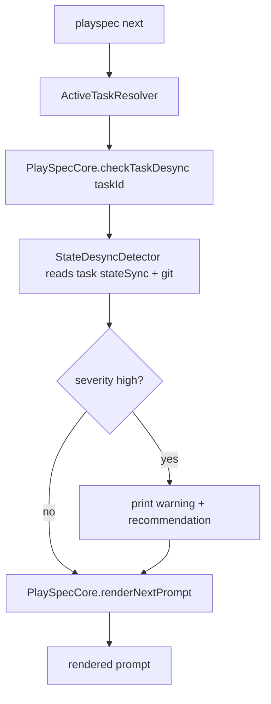
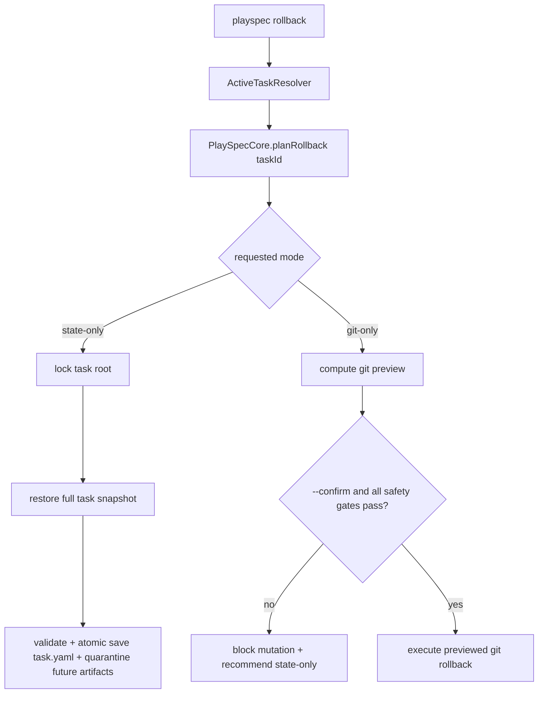

# PlaySpec Phase 3 Implementation Spec

## 1. How to read this spec

This is a first-draft, implementation-ready technical spec for Dev Phase `3` only.

Treat `docs/playspec_total_spec.md` as architecture truth and `docs/playspec_phase_plan.md` as phase-boundary truth. This spec is intentionally limited to Reality Safety: detecting when PlaySpec state no longer matches the real Git workspace, warning before unsafe prompt generation, and providing safe rollback behavior.

This spec does not authorize MCP, archive, evolution, viewer, harness, DAG execution, or broad workflow editing.

## 2. Phase boundary alignment

### Locked Phase 3 goal

Dev Phase `3` enables PlaySpec to notice when its task state and the actual Git workspace have drifted apart, then guide the user toward safe recovery instead of blindly rendering the next prompt or performing dangerous rollback.

### Why this phase exists

Phase `2` records completion artifacts, snapshots, evidence, and phase history. That is enough to know where PlaySpec believed the workflow was at completion time. It is not enough to know whether the workspace changed afterward. Phase `3` adds the safety layer that compares stored task reality with current Git reality.

### In scope

- `StateDesyncDetector`
- persisted `stateSync.lastKnownGitHead`
- changed files since last complete / safe point
- deleted and renamed file detection
- desync severity calculation
- `next` sanity check before prompt rendering
- rollback safe point
- state-only rollback
- git rollback preview
- clean working tree guard
- CLI:
  - `playspec desync-check`
  - `playspec rollback`
  - `playspec rollback --state-only`
  - `playspec rollback --git-only`

### Out of scope

- MCP adapter
- archive / close task behavior
- evolution proposals
- markdown viewer
- harness retry / circuit breaker
- automatic stash creation
- untracked file deletion
- automatic patch rollback when new commits exist
- broad write-lock retrofit for all old paths
- SQLite storage
- DAG execution

### Dependencies

- Phase `2` completion artifacts exist on the active path:
  - `playspec complete`
  - `playspec evidence`
  - `playspec snapshot`
  - phase-scoped evidence/snapshot/review artifacts
  - `TaskStore.completePhase()`
  - lock-protected completion write path
- `execa` is already available and used for git commands.
- `task.yaml` schema validation is centralized through zod.

### What must be complete before Phase 4 can safely begin

- Core exposes task-explicit desync and rollback APIs that do not depend on global `HEAD`.
- CLI can use `HEAD` fallback, but Core methods accept explicit `taskId`.
- `next` warns on high desync before rendering through the active CLI path.
- `desync-check` produces severity and changed-file output.
- `rollback --state-only` restores task state from a safe point without mutating Git.
- Git rollback defaults to preview; `rollback --git-only --confirm` may mutate Git only when every safety gate passes.
- Dangerous Git states recommend state-only rollback instead of attempting automatic changes.

### What visible capability this phase introduces

After this phase, a user can run:

```bash
playspec desync-check
playspec rollback --state-only
playspec rollback --git-only
playspec next
```

and see PlaySpec detect significant drift, explain the changed files/severity, and avoid unsafe Git mutation when the workspace is dirty or has advanced commits.

### What would make this phase unsafe even if partially implemented

- `next` can still render without checking current Git reality.
- `desync-check` exists but does not compare against persisted completion/safe-point state.
- rollback mutates Git when the working tree has uncommitted changes.
- rollback deletes untracked files by default.
- Core rollback/desync APIs rely on global `HEAD`.
- state-only rollback updates only `currentPhase` but leaves `phaseHistory`, `status`, or rollback metadata incoherent.
- `rollback --git-only --confirm` mutates Git without passing every safety gate.

## 3. Phase Outcome at a Glance

### After this phase, you can

- inspect task/workspace drift with `playspec desync-check`
- see low/medium/high desync severity and changed files
- get a high-desync warning before `playspec next` renders a prompt
- create and use rollback safe points tied to phase completion state
- perform state-only rollback safely
- preview Git rollback impact
- run confirmed Git rollback only when the clean-tree, no-new-commit, and untracked-deletion guards pass

### After this phase, you still cannot

- use MCP tools for desync or rollback
- archive rolled-back tasks
- view rollback timelines in a web viewer
- apply evolution proposals
- auto-stash without user approval
- safely delete untracked files by default
- recover arbitrary non-Git filesystem changes

### This phase is ready to implement / hand off when

- the active CLI/Core/store entry points are identified
- the old-path and bypass risks are explicit
- tests can prove observable desync and rollback behavior
- the implementation plan stays within the Phase `3` boundary

## 4. Current implementation vs proposed direction

### Verified current behavior

- `src/cli/index.ts` registers `next`, `phase`, `complete`, `evidence`, and `snapshot`; it does not register `desync-check` or `rollback`.
- `src/cli/commands/next.ts` resolves an active task, renders the prompt, and optionally writes the rendered prompt. It does not run a desync sanity check.
- `src/cli/commands/complete.ts` resolves a task and calls `PlaySpecCore.completePhase()`.
- `src/core/playspec-core.ts` can render prompts, complete phases, collect evidence, and create snapshots.
- `PlaySpecCore.writeEvidence()` collects `git status --short --branch --untracked-files=all`, `git diff --stat --no-ext-diff`, and changed file names from `git status --porcelain --untracked-files=all`.
- `PlaySpecCore.completePhase()` writes snapshots/evidence/review before calling `TaskStore.completePhase()`.
- `YamlTaskStore.completePhase()` atomically updates `status`, `currentPhase`, `updatedAt`, and `phaseHistory`.
- `TaskRecord` and `TaskRecordSchema` do not include `stateSync` or `rollback`.
- No `StateDesyncDetector`, `RollbackManager`, rollback result type, or desync result type exists.
- Phase `2` handoff explicitly lists rollback and desync engine as deferred.

### Inferred but not fully verified

- Existing evidence files can help users inspect current Git state, but they are not used by code as a baseline for desync comparison.
- Existing completion snapshots can be reused as rollback safe-point material, but there is no current API that treats them as safe points.
- The project currently uses `execa` instead of `simple-git`; Phase `3` can keep using `execa` for localized Git operations unless implementation finds a strong reason to switch.

### Intended Phase 3 direction

Add a small Core-level reality safety layer around the existing task lifecycle:

- persist task sync metadata in `task.yaml`
- detect current Git state against that metadata
- expose explicit-task Core methods for desync and rollback
- wire CLI commands with `HEAD` fallback
- run a sanity check before `next`
- make rollback default to safe preview/recommendation behavior

Avoid a framework-like safety subsystem. The Phase `3` implementation should be a focused detector plus rollback manager that uses the existing `TaskStore`, zod schema, `withWriteLock()`, and atomic YAML writes.

## 5. Use Case Alignment for this Phase

| Use case | Current status | Phase 3 expected result | Observable result |
|---|---:|---|---|
| User completed a phase, then manually changed many files before `playspec next` | blocked | `next` checks Git reality first | high desync warning before prompt output |
| User wants to inspect drift without rendering a prompt | missing | `desync-check` reports severity and changed files | CLI prints severity plus changed/deleted/renamed files |
| User wants to undo PlaySpec phase state only | missing | `rollback --state-only` restores task state from safe point | `task.yaml` `status/currentPhase/phaseHistory` match safe point |
| User wants to know what Git rollback would do | missing | `rollback --git-only` previews; `rollback --git-only --confirm` executes only when safe | CLI prints preview, safety reason, and the exact confirm command when eligible |
| Workspace has uncommitted changes | missing | automatic Git rollback is blocked | CLI recommends state-only rollback |
| New commit exists after safe point | missing | automatic patch rollback is blocked | CLI prints new-commit safety warning |
| User expects untracked files to be removed during rollback | out-of-phase | default refuses deletion | CLI states untracked deletion is not performed |

## 6. Relevant files reviewed

### must-read

- `docs/playspec_phase_plan.md`
- `docs/playspec_total_spec.md`
- `docs/playspec_phase2_handoff.md`
- `docs/playspec_phase2_implementation_result.md`
- `src/cli/index.ts`
- `src/cli/commands/next.ts`
- `src/cli/commands/complete.ts`
- `src/core/playspec-core.ts`
- `src/core/active-task-resolver.ts`
- `src/core/types.ts`
- `src/core/schemas.ts`
- `src/storage/task-store.ts`
- `src/storage/yaml-task-store.ts`
- `src/utils/fs.ts`
- `src/utils/paths.ts`
- `src/core/errors.ts`

### maybe-read

- `src/cli/commands/evidence.ts`
- `src/cli/commands/snapshot.ts`
- `src/cli/commands/phase.ts`
- `tests/integration/completion-engine.test.ts`
- `tests/cli.test.ts`
- `tests/integration/active-task-resolver.test.ts`
- `tests/helpers/createTempWorkspace.ts`
- `package.json`

### ignore-for-now

- `src/template/**`
- `src/workflow/**` except if phase resolution is needed for rollback state tests
- `src/preset/**` except test setup fixtures
- `src/core/session-resolver.ts`
- create/list/current/init/use CLI behavior except as old-path notes
- MCP, archive, viewer, evolution, harness, DAG material

## 7. Active entry points and possible bypasses

| Entry point / call site | Current behavior | Status | Why it matters to this phase |
|---|---|---:|---|
| `src/cli/index.ts` `next` command | calls `runNext()` | partial | Must become the active pre-render sanity-check path. |
| `src/cli/commands/next.ts` `runNext()` | resolves task, renders prompt, optional prompt file write | partial | Main visible place where high desync must warn before output. |
| `src/core/playspec-core.ts` `renderNextPrompt()` | renders current phase prompt without Git/state sync check | partial | Core render path can be bypassed by callers unless Phase 3 defines where sanity belongs. |
| `src/cli/index.ts` `complete` command | calls `runComplete()` | partial | Completion should persist or refresh `stateSync` and safe-point metadata. |
| `src/core/playspec-core.ts` `completePhase()` | writes snapshots/evidence/review then advances task state | partial | Best existing place to capture last known Git HEAD and rollback safe point. |
| `src/storage/yaml-task-store.ts` `completePhase()` | atomically mutates completion state only | partial | Needs schema-compatible persistence for `stateSync` / rollback metadata. |
| `src/cli/commands/evidence.ts` `runEvidence()` | manually writes Git evidence files | partial | Useful reference behavior but not a desync detector. |
| `src/cli/commands/snapshot.ts` `runSnapshot()` | manually writes task snapshot | partial | Useful safe-point material but no rollback semantics. |
| `src/cli/index.ts` missing `desync-check` | no command | missing | Required user-facing inspection path. |
| `src/cli/index.ts` missing `rollback` | no command | missing | Required user-facing recovery path. |

### Possible bypasses / old paths

- Direct calls to `PlaySpecCore.renderNextPrompt()` can render without CLI `next`; Phase `3` adds `PlaySpecCore.checkTaskDesync(taskId)` as the checked Core boundary and keeps raw render methods documented as unchecked rendering primitives.
- `playspec phase <phaseId>` also renders prompts. Minimum Phase `3` acceptance requires `next`; `phase` and `complete` sanity checks are warning-only optional work unless explicitly implemented without expanding rollback/desync scope.
- `src/cli/commands/next.ts --write` writes prompt files outside the task write lock. Phase `3` does not need to retrofit this unless the sanity check writes sync snapshots.
- Existing unlocked `create`, `use`, and preset init paths remain old paths from Phase `2`; they should not be folded into rollback/desync work unless they directly block Phase `3`.
- Evidence files can look like desync support but are passive artifacts. Do not treat them as completion of `StateDesyncDetector`.

## 8. Verified behavior and constraints

- Core methods already accept explicit `taskId`.
- CLI commands may resolve `HEAD` through `ActiveTaskResolver`.
- Phase `2` write operations use `withWriteLock()` for completion, evidence, and snapshot artifact writes.
- `TaskStore.updateTask()` remains generic and unlocked; `TaskStore.completePhase()` is the active completion mutation path.
- `TaskRecordSchema` rejects unknown required structured fields unless added explicitly.
- Current Git helpers throw `GitEvidenceCollectionError` for evidence collection failures only.
- Tests initialize real Git repos in temporary workspaces, so Phase `3` can test Git behavior without touching the repository root.
- `package.json` already includes `execa` and `simple-git`; current implementation uses `execa`.

## 9. What is already implemented vs what still needs verification

### Already implemented

- active task resolution with explicit task or `HEAD` fallback
- prompt rendering for `next` and explicit `phase`
- completion state advancement
- completion snapshots
- manual snapshots
- git evidence collection
- atomic completion state write
- task-level write lock helper
- test helpers for temp workspace and Git repo setup

### Still needs implementation / verification in Phase 3

- task schema fields for `stateSync` and rollback metadata
- Core `StateDesyncDetector`
- Core rollback manager/path
- current Git HEAD capture and comparison
- changed/deleted/renamed file classification since safe point
- severity rules
- `desync-check` CLI command
- `rollback` CLI command and flags
- `next` sanity check behavior
- clean working tree guard
- new-commit guard
- untracked file deletion refusal
- state-only rollback coherence across `status`, `currentPhase`, `phaseHistory`, and rollback metadata

## 10. Proposed implementation direction for this phase

### Data model

Add minimal optional fields to `TaskRecord` and `TaskRecordSchema`:

```ts
interface TaskStateSync {
  lastKnownGitHead: string | null;
  lastCompletedAt: string | null;
  lastCompletedDiffHash?: string | null;
  lastSanityCheckAt?: string | null;
}

interface TaskRollbackState {
  lastSafePoint: RollbackSafePoint | null;
}

interface RollbackSafePoint {
  id: string;
  createdAt: string;
  phase: string;
  gitHead: string | null;
  taskSnapshotFile: string;
  promptSnapshotFile?: string;
}
```

Keep fields optional for backward compatibility with existing `task.yaml` files, but make newly created/updated records write a normalized shape.

### Desync detector

Add a small Core service, for example `src/core/state-desync-detector.ts`, with no CLI dependency:

```ts
run(task: TaskRecord): Promise<DesyncCheckResult>
```

The result should include:

- `taskId`
- `severity: 'none' | 'low' | 'medium' | 'high'`
- `currentGitHead`
- `lastKnownGitHead`
- `changedFiles`
- `deletedFiles`
- `renamedFiles`
- `untrackedFiles`
- `reasons`
- `recommendedAction`

Minimum severity rules from the phase plan:

- `low`: small doc changes or formatting-only changes
- `medium`: files changed outside expected phase outputs or new files added
- `high`: Git HEAD changed, target files deleted/renamed, or heavy `projectDocRoot` changes

Keep the first implementation deterministic and conservative. Avoid warning fatigue: ordinary uncommitted work after a prompt is expected and should normally be `medium`, not `high`. Use these first-pass thresholds unless implementation finds a smaller strictly local reason to tighten them:

- `medium`: uncommitted tracked source changes after the last safe point, including large diffs, unless a `high` rule also matches
- heavy `projectDocRoot` changes: at least `10` changed files under `task.paths.projectDocRoot` or deletion/rename of any phase output document
- `high`: current Git HEAD differs from `stateSync.lastKnownGitHead`, any target/phase output file is deleted or renamed, or the heavy `projectDocRoot` threshold is reached
- `low`: changed set limited to docs or known output files, below the thresholds above
- fallback: when classification is ambiguous, use `medium` rather than silently recording `low`

### Completion integration

Update the completion path so successful `completePhase()` records:

- current Git HEAD as `stateSync.lastKnownGitHead`
- completion timestamp as `stateSync.lastCompletedAt`
- rollback safe point metadata pointing to the completion task snapshot
- phase completion state, `stateSync`, and rollback safe-point metadata in one locked atomic task mutation

Do this on the active completion path only:

```text
CLI complete -> ActiveTaskResolver -> PlaySpecCore.completePhase() -> TaskStore.completePhase()
```

Avoid using generic `updateTask()` for the final completion mutation if it would split state across multiple writes. Extend `CompletePhaseInput` / `TaskStore.completePhase()` as needed so the active completion path writes the phase state, sync metadata, and safe point together.

### `next` sanity check

Before rendering in `runNext()`:

1. resolve the task
2. run desync check through Core
3. if severity is `high`, print warning and recommended action before rendering
4. preserve non-interactive behavior by not blocking forever for input

For Phase `3`, a warning before prompt output satisfies the phase acceptance. If implementation adds `--force` / `--refresh` style options, keep them minimal and do not implement later-phase context refresh workflows.

### `desync-check`

Add a CLI command:

```bash
playspec desync-check [--task TASK_ID]
```

Output should include:

- task ID
- severity
- last known Git HEAD
- current Git HEAD
- changed files
- deleted/renamed files when present
- recommended action

### Rollback manager

Add a Core rollback path that supports:

- state-only rollback from last safe point
- git rollback preview
- clean working tree guard

Default `playspec rollback` should not mutate Git. It should inspect safety and print the safest available option. `rollback --state-only` is the required mutation path.

State-only rollback should:

- acquire the task write lock
- load the last safe-point task snapshot
- restore the full task snapshot needed for coherent `status`, `currentPhase`, `phaseHistory`, `stateSync`, and rollback metadata
- validate the restored task with `TaskRecordSchema` before saving
- quarantine future PlaySpec artifacts created after the target safe point under `.playspec/tasks/.../rollback/` instead of leaving them active
- preserve or update rollback metadata so repeated rollback does not create an inconsistent task
- not mutate project Git files outside `.playspec`

Git rollback preview should:

- compare current Git state to the safe point
- print files/commits that would be affected
- refuse automatic mutation when dirty, when new commits exist, or when untracked deletion would be needed

Git rollback execution should:

- require `--git-only --confirm`
- reuse the same rollback plan printed by preview
- execute only when the working tree is clean, no new commit exists after the safe point, no branch/pull divergence is detected, and no untracked deletion would be required
- refuse execution and recommend state-only rollback when any gate fails

### Errors

Add explicit `PlaySpecError` subclasses only where user recovery differs:

- no rollback safe point
- desync check failed because Git is unavailable
- unsafe Git rollback blocked
- rollback snapshot missing or invalid

Do not create a large error hierarchy for every severity reason.

## 11. Testable outcomes

| Test scenario | Entry point | Required setup | Expected observable result | Status | Out-of-phase failure acceptable |
|---|---|---|---|---:|---:|
| Clean task after completion | Core desync API / `desync-check` | init, create, git commit, complete, no further changes | severity `none` or `low`, current HEAD equals last known HEAD | testable after implementation | no |
| Manual file edit after completion | `playspec desync-check` | complete phase, edit tracked source file | severity at least `medium`, changed file listed | testable after implementation | no |
| Git HEAD changed after completion | `playspec desync-check` | complete phase, create new commit | severity `high`, HEAD change reason shown | testable after implementation | no |
| Deleted tracked file after completion | `playspec desync-check` | complete phase, delete tracked file | severity `high`, deleted file listed | testable after implementation | no |
| Renamed tracked file after completion | `playspec desync-check` | complete phase, `git mv` tracked file | severity `high`, renamed file listed | testable after implementation | no |
| High desync before next | `playspec next` | complete phase, create new commit or delete target file | warning appears before prompt text | testable after implementation | no |
| State-only rollback | `playspec rollback --state-only` | complete phase, advance state, rollback safe point exists | `task.yaml` restored from the validated safe-point task snapshot, Git files unchanged | testable after implementation | no |
| Confirmed clean Git rollback | `playspec rollback --git-only --confirm` | safe point exists, clean working tree, no new commits, no untracked deletion needed | Git rollback executes using the previewed plan | testable after implementation | no |
| Dirty tree Git rollback guard | `playspec rollback --git-only --confirm` | safe point exists, uncommitted change exists | no Git mutation, state-only recommendation printed | testable after implementation | no |
| New commit Git rollback guard | `playspec rollback --git-only --confirm` | safe point exists, new commit exists | automatic patch rollback blocked | testable after implementation | no |
| Untracked file deletion guard | `playspec rollback --git-only` | safe point exists, untracked file exists | untracked deletion refused by default | testable after implementation | no |
| MCP desync tool | MCP server | any | not implemented | not yet testable | yes |
| Archive after rollback | archive command | any | not implemented | not yet testable | yes |

### Reviewer demo scenario

1. `playspec init --preset default`
2. `playspec create multi-spec "Reality Safety Demo"`
3. initialize Git and commit baseline
4. `playspec complete`
5. edit or delete a tracked file
6. run `playspec desync-check`
7. confirm severity and changed/deleted files are shown
8. run `playspec next`
9. confirm warning appears before rendered prompt
10. run `playspec rollback --state-only`
11. confirm task state returns to the safe point and Git files are not changed

## 12. Example review / demo scenarios

### Scenario A: high desync warning

Expected reviewer observation:

- `desync-check` reports high severity after Git HEAD changes or a tracked file is deleted.
- `next` prints a warning before prompt rendering.
- The warning includes changed/deleted file context and a safe recommendation.

### Scenario B: safe state rollback

Expected reviewer observation:

- `rollback --state-only` restores task state from the last safe point.
- `phaseHistory` and `currentPhase` are coherent together.
- No project source file changes are made by state-only rollback.

### Scenario C: unsafe Git rollback preview

Expected reviewer observation:

- With dirty working tree, `rollback --git-only` refuses automatic mutation.
- CLI recommends state-only rollback.
- Untracked files remain untouched.

## 13. Risks / open questions

### Controlled risk: Core render bypass

Raw render methods remain unchecked rendering primitives. Phase `3` safety ownership is the explicit Core `checkTaskDesync(taskId)` method and the active CLI `next` pre-render call to that method.

Required control: expose `PlaySpecCore.checkTaskDesync(taskId)` and have `runNext()` call it before render. Do not hide `HEAD` lookup in Core.

### Medium risk: completion state and sync metadata split write

If completion advances phase state and then separately writes `stateSync`, a crash can leave completion and sync metadata inconsistent.

Required control: extend `CompletePhaseInput` / `TaskStore.completePhase()` so completion state, `stateSync`, and safe-point metadata are persisted in one atomic task write.

### Medium risk: rollback state coherence

Restoring only `currentPhase` can leave `status`, `phaseHistory`, and safe-point metadata mismatched.

Required control: state-only rollback restores from the stored full task snapshot and validates through `TaskRecordSchema` before writing.

### Controlled risk: Git preview vs mutation path

Phase `3` defines Git mutation only through `rollback --git-only --confirm` after a safe preview plan exists.

Required control: compute one rollback plan result and execute only that plan when the user passes `--confirm` and all clean-tree, no-new-commit, no-divergence, and no-untracked-deletion gates pass.

### Low risk: old unlocked write paths

`create`, `use`, preset init, and `next --write` remain unlocked old paths.

Smallest safe fix: acknowledge them as old paths and avoid expanding Phase `3` to retrofit them unless a Phase `3` write directly uses them.

### Open questions

No architecture/spec-level open questions remain.

## 14. Mermaid diagrams




