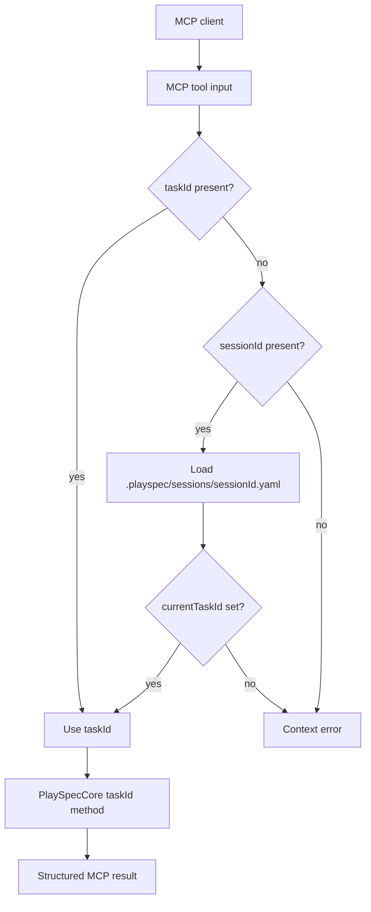

# PlaySpec Dev Phase 4.0 Implementation Spec - MCP Adapter

## 1. How to Read This Spec

This is a first-draft, implementation-ready spec for Dev Phase 4.0 only. It is derived from `docs/playspec_phase_plan.md` as the phase-boundary truth and `docs/playspec_total_spec.md` as architecture truth.

This spec does not authorize Phase 4.1 migration, Phase 5 archive, harness tools, evolution tools, viewer work, or broad Core redesign. The implementation should add the smallest MCP adapter surface that exposes existing Core behavior through explicit task context.

## 2. Phase Boundary Alignment

Phase 4.0 enables Claude Code, Codex, and OpenClaw to use PlaySpec through an MCP stdio server.

In scope:

- MCP stdio server.
- MCP tools for task list/get.
- MCP tool for rendering the next prompt.
- MCP tool for rendering an explicit phase prompt.
- MCP tool for completing the current phase.
- MCP tool for collecting evidence.
- MCP tool for running a desync check.
- MCP tool for state rollback.
- MCP tools for session task set/get.
- MCP input schema validation.
- Explicit `taskId` or `sessionId` requirement.
- No MCP global HEAD fallback.

Out of scope:

- MCP-driven context migration from historical markdown docs.
- Archive, close, archived task listing, and archived context reads.
- Harness status, attempt result recording, unblock tools.
- Evolution context, proposal, or apply tools.
- Viewer.
- SQLite.
- DAG execution or automatic spawning.
- Any direct coupling from Core to MCP.

The phase is unsafe if an MCP request can mutate state by accidentally resolving `.playspec/HEAD`, if session context can silently point nowhere without a clear error, or if the MCP tool path reimplements behavior differently from `PlaySpecCore`.

## 3. Phase Outcome at a Glance

After this phase, you can:

- Start a PlaySpec MCP server over stdio.
- Ask an MCP client to list active/completed tasks.
- Read a task by explicit `taskId`.
- Render the same next prompt that `PlaySpecCore.renderNextPrompt(taskId)` renders.
- Render an explicit workflow phase prompt for an explicit task.
- Complete a phase through MCP using explicit `taskId` or `sessionId`.
- Collect evidence, run desync check, and perform state-only rollback through MCP.
- Set and read a session's current task.

After this phase, you still cannot:

- Use MCP to migrate historical docs into PlaySpec state.
- Use MCP to archive tasks or read archived context.
- Use MCP harness/evolution tools.
- Let MCP infer the current task from `.playspec/HEAD`.
- Treat helper DTOs or a server shell with no registered working tools as phase completion.

This phase is ready to implement / hand off when:

- The active MCP stdio entry point runs.
- Every phase-scoped tool resolves task context through `taskId` or `sessionId`.
- Missing `taskId` and missing/empty `sessionId` context fail before Core mutation.
- No MCP code imports or calls `ActiveTaskResolver.resolveTask()` without an explicit `taskId`.
- `render_next_prompt` uses `PlaySpecCore.renderNextPrompt(taskId)` and returns the same prompt body as the Core path used by CLI.
- Tests prove the no-HEAD rule.

## 4. Current Implementation vs Proposed Direction

Verified current behavior:

- `PlaySpecCore` already exposes taskId-based methods for render next, render explicit phase, complete, collect evidence, create snapshot, desync check, rollback plan, state-only rollback, and git rollback in `src/core/playspec-core.ts`.
- `YamlTaskStore` supports task get/list/create/update/complete for active tasks in `src/storage/yaml-task-store.ts`.
- `SessionResolver` can load a session YAML by `sessionId` in `src/core/session-resolver.ts`.
- `SessionRecord` and `SessionRecordSchema` exist in `src/core/types.ts` and `src/core/schemas.ts`.
- CLI command wrappers use `ActiveTaskResolver`, which falls back to `.playspec/HEAD` when no task id is passed.
- `package.json` does not currently include `@modelcontextprotocol/sdk`.
- There is no MCP server entry point or MCP tool registration in `src/`.
- There is no session write/update API.

Inferred but not fully verified:

- The existing test pattern for CLI integration through `tsx` can be adapted for an MCP server process, but the exact MCP client test helper is not yet present.
- The implementation will likely need one new MCP directory under `src/mcp/` plus tests; exact file split can be chosen during implementation if it stays small.

Proposed direction for this phase:

- Add `@modelcontextprotocol/sdk`.
- Add a thin MCP adapter that constructs `YamlTaskStore` and `PlaySpecCore` from `process.cwd()`.
- Add an MCP-only context resolver that accepts `{ taskId?: string; sessionId?: string }`, prefers `taskId`, resolves `sessionId` through session YAML, and never reads `.playspec/HEAD`.
- Add minimal session set/get persistence under `.playspec/sessions/{sessionId}.yaml`.
- Register only Phase 4.0 tools.
- Return structured JSON-compatible tool results, not CLI-formatted stdout.
- Reuse Core methods for behavior rather than duplicating render, completion, evidence, desync, or rollback logic.

## 5. Use Case Alignment for This Phase

Use case: MCP client lists current PlaySpec tasks.

- Current status: partial.
- Existing support: `YamlTaskStore.listActiveTasks()` and `listCompletedTasks()`.
- Missing: MCP tool wrapper and schema.
- Observable result: MCP response contains active and completed task summaries.

Use case: MCP client renders the next prompt for a known task.

- Current status: partial.
- Existing support: `PlaySpecCore.renderNextPrompt(taskId)`.
- Missing: MCP stdio tool and explicit context validation.
- Observable result: returned prompt text matches the Core render result for the same `taskId`.

Use case: MCP client renders a specific phase prompt.

- Current status: partial.
- Existing support: `PlaySpecCore.renderExplicitPhasePrompt(taskId, phaseId)`.
- Missing: MCP tool and input schema.
- Observable result: returned prompt text contains the requested phase content.

Use case: MCP client completes a phase.

- Current status: partial.
- Existing support: `PlaySpecCore.completePhase(taskId, { withReview, result })`.
- Missing: MCP tool and no-HEAD context guard.
- Observable result: `task.yaml` advances phase or marks task completed, and completion artifacts are written.

Use case: MCP client records session task context and later uses that session.

- Current status: partial.
- Existing support: `SessionResolver.loadSession(sessionId)` reads existing YAML.
- Missing: session write/update API and MCP set/get tools.
- Observable result: `.playspec/sessions/{sessionId}.yaml` stores `currentTaskId`, and later phase tools can resolve that task from `sessionId`.

Use case: MCP client performs state-only rollback.

- Current status: partial.
- Existing support: `PlaySpecCore.rollbackStateOnly(taskId)`.
- Missing: MCP tool and explicit rollback mode contract.
- Observable result: task YAML is restored from the last safe point and source files are left untouched.

Out-of-phase use cases:

- Migrating historical markdown documents into PlaySpec state is Phase 4.1.
- Archiving and archived reads are Phase 5.
- Harness and evolution MCP tools are later phases even though the total spec lists future MCP tool names.

## 6. Relevant Files Reviewed

Must-read:

- `docs/playspec_phase_plan.md`
- `docs/playspec_total_spec.md`
- `package.json`
- `tsconfig.json`
- `src/core/playspec-core.ts`
- `src/core/types.ts`
- `src/core/schemas.ts`
- `src/core/errors.ts`
- `src/core/session-resolver.ts`
- `src/core/active-task-resolver.ts`
- `src/storage/task-store.ts`
- `src/storage/yaml-task-store.ts`
- `src/cli/index.ts`
- `src/cli/commands/next.ts`
- `src/cli/commands/phase.ts`
- `src/cli/commands/complete.ts`
- `src/cli/commands/evidence.ts`
- `src/cli/commands/desync-check.ts`
- `src/cli/commands/rollback.ts`
- `tests/cli.test.ts`
- `tests/integration/active-task-resolver.test.ts`
- `tests/integration/init-create-next.test.ts`

Maybe-read:

- `src/core/state-desync-detector.ts`
- `src/core/rollback-manager.ts`
- `src/core/git-state.ts`
- `src/utils/paths.ts`
- `src/utils/fs.ts`
- `src/preset/assets/default/sessions/cli.default.yaml`
- `tests/integration/completion-engine.test.ts`
- `tests/integration/task-store.test.ts`

Ignore for now:

- `src/template/**`
- `src/workflow/**`
- `src/preset/**` except default session fixture if needed
- archive, evolution, harness, viewer, and Phase 4.1 docs

## 7. Active Entry Points and Possible Bypasses

Entry point / call site: `src/core/playspec-core.ts` `PlaySpecCore.renderNextPrompt(taskId)`

- Current behavior: Loads task by explicit `taskId`, validates context refs, loads workflow, resolves current phase, renders template.
- Status: done for Core behavior, missing MCP exposure.
- Why it matters: MCP `render_next_prompt` must return this result instead of copying CLI formatting or reading HEAD.

Entry point / call site: `src/core/playspec-core.ts` `PlaySpecCore.renderExplicitPhasePrompt(taskId, phaseId)`

- Current behavior: Loads task by explicit `taskId`, resolves requested phase, renders template.
- Status: done for Core behavior, missing MCP exposure.
- Why it matters: MCP explicit phase prompt should be a direct adapter over this method.

Entry point / call site: `src/core/playspec-core.ts` `PlaySpecCore.completePhase(taskId, options)`

- Current behavior: Requires active task, validates routing result, writes snapshots/evidence/review as applicable, updates task state through `TaskStore.completePhase`.
- Status: done for Core behavior, missing MCP exposure.
- Why it matters: This is the main state mutation path and must be protected by explicit MCP context.

Entry point / call site: `src/core/playspec-core.ts` `collectEvidence`, `checkTaskDesync`, `rollbackStateOnly`, `planRollback`

- Current behavior: Operate by explicit `taskId`.
- Status: done for Core behavior, missing MCP exposure.
- Why it matters: These satisfy Phase 4.0 evidence, desync, and state rollback scope.

Entry point / call site: `src/core/session-resolver.ts` `SessionResolver.loadSession(sessionId)`

- Current behavior: Reads `.playspec/sessions/{sessionId}.yaml` and validates it.
- Status: partial.
- Why it matters: Session-based MCP context can reuse this read path, but Phase 4.0 still needs a write path for session task set.

Entry point / call site: `src/core/active-task-resolver.ts` `ActiveTaskResolver.resolveTask(taskId?)`

- Current behavior: Uses explicit `taskId` when provided; otherwise reads `.playspec/HEAD`.
- Status: partial and dangerous for MCP if used incorrectly.
- Why it matters: MCP must avoid this resolver for missing task context, or call it only with a guaranteed explicit task id. A safer MCP-specific resolver is preferred.

Entry point / call site: CLI command wrappers in `src/cli/commands/*.ts`

- Current behavior: Human CLI commands commonly allow `--task` but fall back to HEAD.
- Status: done for CLI, bypass risk for MCP.
- Why it matters: MCP tools should not call CLI wrappers because they include human-facing stdout and HEAD fallback behavior.

Possible bypasses:

- Old path: CLI commands use `ActiveTaskResolver` and HEAD fallback. This remains valid for human CLI.
- Bypass path: An MCP tool calling `runNext`, `runComplete`, `runEvidence`, `runDesyncCheck`, or `runRollback` with no task option would read HEAD. Do not do this.
- Dual path risk: If MCP reimplements completion or rendering separately, CLI/Core and MCP behavior can drift.
- Partial migration risk: Adding MCP schemas without an executable stdio server or adding server registration without no-HEAD tests would not satisfy the phase.

## 8. Verified Behavior and Constraints

- Core is already independent of CLI and MCP.
- Core receives explicit `taskId` for all phase-relevant operations.
- CLI allows HEAD fallback for human convenience.
- MCP must require `taskId` or `sessionId`.
- If both `taskId` and `sessionId` are supplied, `taskId` should take precedence for predictability.
- If `sessionId` resolves to `currentTaskId: null`, the MCP tool must fail before invoking Core.
- State-changing MCP tools must not accept ambiguous context.
- MCP should not read or write files outside `.playspec` except through existing Core operations that collect git state.
- Git rollback execution is risky; Phase 4.0 phase plan says state rollback, so the initial MCP rollback tool should expose state-only rollback and optionally rollback planning, not confirmed git rollback unless explicitly justified by the phase owner.

## 9. Already Implemented vs Still Needs Verification

Already implemented:

- Task listing and lookup in `YamlTaskStore`.
- TaskId-based prompt rendering in Core.
- TaskId-based phase completion in Core.
- TaskId-based evidence collection in Core.
- TaskId-based desync check in Core.
- TaskId-based rollback planning and state-only rollback in Core.
- Session record type/schema and session read path.
- CLI tests proving existing human workflows.

Still needs implementation:

- MCP SDK dependency.
- MCP stdio entry point.
- MCP tool registration.
- MCP input schemas.
- MCP context resolver that never falls back to HEAD.
- Session set/update persistence.
- Tests for missing context, explicit task context, session context, and no HEAD usage.

Still needs verification after implementation:

- The package build emits the MCP entry point.
- MCP server starts over stdio.
- MCP tool results are JSON-compatible and stable enough for clients.
- MCP errors preserve actionable messages without relying on CLI stderr formatting.

## 10. Proposed Implementation Direction for This Phase

Add a focused MCP module:

- `src/mcp/index.ts`: executable stdio server entry point.
- `src/mcp/server.ts`: server construction and tool registration.
- `src/mcp/context.ts`: resolve `{ taskId?, sessionId? }` to task id without HEAD fallback.
- `src/mcp/schemas.ts`: zod schemas for MCP tool inputs.
- `src/mcp/session-store.ts`: minimal YAML read/write for `.playspec/sessions/{sessionId}.yaml`, or extend `SessionResolver` if kept Core-safe.

Register only these Phase 4.0 tools:

- `playspec_list_tasks`
- `playspec_get_task`
- `playspec_use_session_task`
- `playspec_get_session_task`
- `playspec_render_next_prompt`
- `playspec_render_phase_prompt`
- `playspec_complete_phase`
- `playspec_collect_evidence`
- `playspec_run_state_desync_check`
- `playspec_rollback_state`

Tool behavior:

- `playspec_list_tasks`: no task context required; returns active and completed summaries from `YamlTaskStore`.
- `playspec_get_task`: requires `taskId`; returns validated `TaskRecord`.
- `playspec_use_session_task`: requires `sessionId` and `taskId`; validates task exists; writes session record.
- `playspec_get_session_task`: requires `sessionId`; returns session record and current task summary if set.
- `playspec_render_next_prompt`: requires `taskId` or `sessionId`; calls `core.renderNextPrompt(resolvedTaskId)`.
- `playspec_render_phase_prompt`: requires `taskId` or `sessionId` plus `phaseId`; calls `core.renderExplicitPhasePrompt`.
- `playspec_complete_phase`: requires `taskId` or `sessionId`; calls `core.completePhase` with optional `withReview` and `result`.
- `playspec_collect_evidence`: requires `taskId` or `sessionId`; calls `core.collectEvidence`.
- `playspec_run_state_desync_check`: requires `taskId` or `sessionId`; calls `core.checkTaskDesync`.
- `playspec_rollback_state`: requires `taskId` or `sessionId`; calls `core.rollbackStateOnly`.

Validation and error direction:

- Use zod for tool inputs.
- Add a small explicit error for missing MCP task context, for example `McpTaskContextRequiredError`.
- Do not call `ActiveTaskResolver.resolveTask()` without a non-empty task id.
- Do not import CLI command modules from MCP.
- Keep Core unaware of MCP.

## 11. Testable Outcomes

Test scenario: MCP server starts.

- Entry point: `src/mcp/index.ts`.
- Required setup: initialized package with MCP SDK dependency.
- Expected observable result: process can start in stdio mode without immediate crash.
- Status: not yet testable.
- Out-of-phase failure acceptable: no.

Test scenario: missing context is rejected.

- Entry point: `playspec_render_next_prompt` MCP tool.
- Required setup: workspace initialized, HEAD points to a valid task.
- Expected observable result: tool call without `taskId` or `sessionId` fails and does not render from HEAD.
- Status: not yet testable.
- Out-of-phase failure acceptable: no.

Test scenario: explicit task render matches Core.

- Entry point: `playspec_render_next_prompt`.
- Required setup: workspace initialized, active task exists.
- Expected observable result: returned prompt equals `PlaySpecCore.renderNextPrompt(taskId)`.
- Status: partially testable through Core today; MCP wrapper not yet testable.
- Out-of-phase failure acceptable: no.

Test scenario: session render uses session current task.

- Entry point: `playspec_use_session_task`, then `playspec_render_next_prompt`.
- Required setup: task exists; session is set to that task.
- Expected observable result: session render returns prompt for the stored task id.
- Status: not yet testable.
- Out-of-phase failure acceptable: no.

Test scenario: empty session current task is rejected.

- Entry point: `playspec_render_next_prompt`.
- Required setup: session YAML exists with `currentTaskId: null`.
- Expected observable result: clear context error before Core is invoked.
- Status: not yet testable.
- Out-of-phase failure acceptable: no.

Test scenario: complete phase through MCP.

- Entry point: `playspec_complete_phase`.
- Required setup: git repo initialized; active task exists.
- Expected observable result: task phase advances and snapshot/evidence files are written.
- Status: partially testable through Core/CLI today; MCP wrapper not yet testable.
- Out-of-phase failure acceptable: no.

Test scenario: reviewer demo.

- Entry point: MCP client calls `playspec_use_session_task`, `playspec_render_next_prompt`, `playspec_complete_phase`, and `playspec_run_state_desync_check`.
- Required setup: initialized workspace, task, git repo.
- Expected observable result: session stores task id, prompt renders, completion advances task, desync check returns structured severity.
- Status: not yet testable.
- Out-of-phase failure acceptable: no.

## 12. Example Review / Demo Scenarios

Reviewer demo 1: explicit task path.

1. Initialize a workspace and create a task.
2. Start the MCP server over stdio.
3. Call `playspec_render_next_prompt` with `taskId`.
4. Compare the prompt body with `PlaySpecCore.renderNextPrompt(taskId)` or CLI `playspec next --task TASK_ID --quiet`.
5. Confirm no `.playspec/HEAD` dependency by changing HEAD to another task and repeating the MCP call.

Reviewer demo 2: session path.

1. Call `playspec_use_session_task` with `sessionId: "mcp.codex"` and a valid `taskId`.
2. Call `playspec_get_session_task` for the same session.
3. Call `playspec_render_next_prompt` with only `sessionId`.
4. Confirm the prompt belongs to the session task, not HEAD.

Reviewer demo 3: state mutation guard.

1. Create a valid HEAD and task.
2. Call `playspec_complete_phase` without `taskId` or `sessionId`.
3. Confirm the tool fails and `task.yaml` is unchanged.

## 13. Risks / Open Questions

Medium risk: Session write ownership is not yet implemented.

- Smallest safe fix: add a minimal session store that validates `SessionRecordSchema` and writes only `.playspec/sessions/{sessionId}.yaml`.

Medium risk: HEAD fallback can leak in if MCP imports CLI wrappers or uses `ActiveTaskResolver` casually.

- Smallest safe fix: make MCP context resolution a separate helper with tests that set HEAD to a different task and prove MCP ignores it.

Low risk: MCP tool names in the total spec include later-phase tools.

- Smallest safe fix: register only Phase 4.0 tools and document deferred tool names.

Low risk: Confirmed git rollback through MCP could exceed "state rollback" wording.

- Smallest safe fix: expose state-only rollback in Phase 4.0; leave git rollback confirmation to a later explicit phase or follow-up decision.

Open question: Should `playspec_get_task` require only `taskId`, or also allow `sessionId`?

- Proposed answer: require `taskId` for direct task read; session reads use `playspec_get_session_task`. This keeps task lookup explicit.

Open question: Should MCP expose `create_snapshot` in Phase 4.0?

- Proposed answer: no. The phase plan lists collect evidence but not create snapshot as an MCP tool, even though Core supports it.

## 14. Mermaid Diagrams

