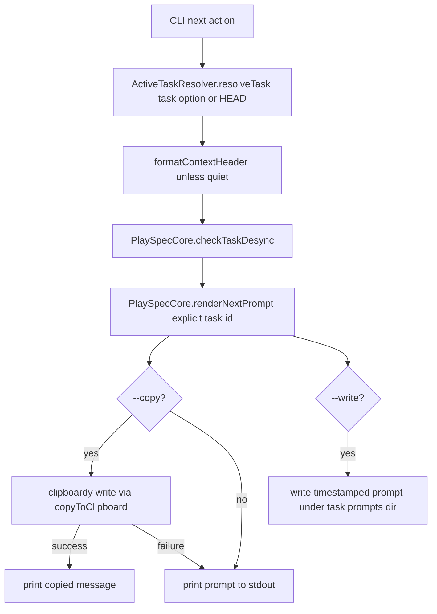
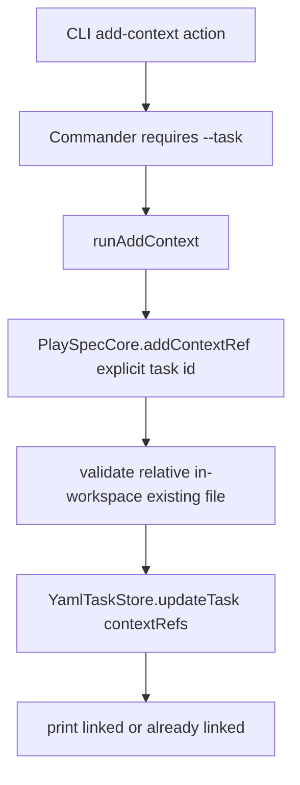
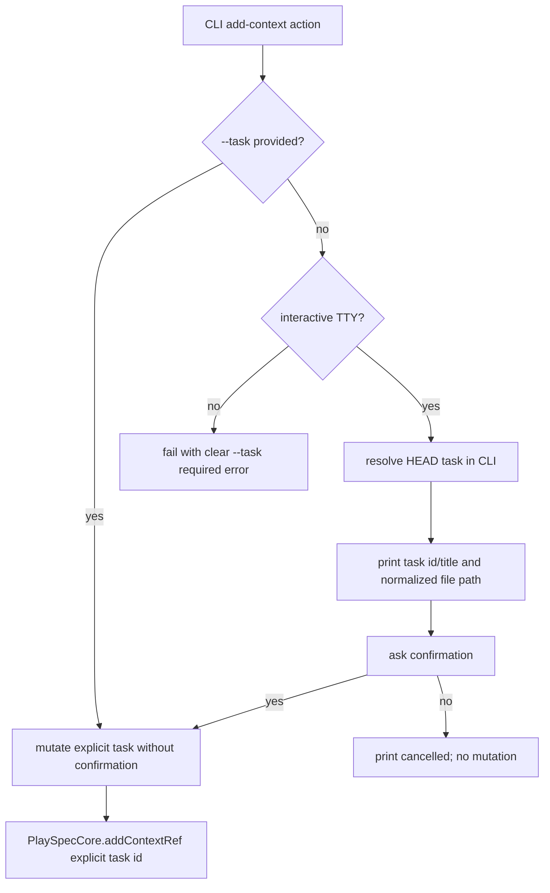

# ux update copy and head - Technical Spec Patch

## Scope

This phase creates the code-level implementation plan for the `ux_update_copy_and_head` feature. It does not implement behavior.

In scope:
- Make `playspec list` and `playspec list-tasks` identify the current HEAD task.
- Improve `playspec current` and `playspec current-task` so linked docs/context refs are visible enough for a human to understand task context.
- Clarify the current/current-task UX difference or converge their output intentionally.
- Make `playspec next` show the resolved upcoming phase before or alongside the prompt.
- Add `playspec add-context <file>` interactive HEAD fallback when `--task` is omitted.
- Keep non-interactive `add-context` explicit and script-safe.
- Harden `playspec next --copy` across headless, SSH, NAS, and missing-clipboard-command environments.
- Add `playspec next --out <file>` and allow `--copy --out <file>`.

Out of scope:
- MCP HEAD fallback. MCP must keep explicit `taskId` or session context resolution through `resolveMcpTaskId()`.
- Core-level global HEAD reads.
- Viewer work, rollback/archive changes, migration behavior changes, or unrelated workflow semantics.

## Use Case Alignment

The source problem asks for a better human CLI experience around "what am I operating on?" and "where did the prompt go?"

Intended user-facing use cases:
- A user runs `playspec list` or `playspec list-tasks` and can immediately see which task is selected by `.playspec/HEAD`.
- A user runs `playspec current` or `playspec current-task` and sees useful linked docs/context references, not only a count.
- A user runs `playspec next` and can see the expected/resolved phase before reading or copying the generated prompt.
- A user runs `playspec add-context docs/foo.md` in an interactive shell and PlaySpec resolves HEAD, prints the target task and file path, asks for confirmation, then mutates only after confirmation.
- A script or non-interactive environment still passes `playspec add-context docs/foo.md --task <id>` explicitly.
- A user runs `playspec next --copy` on SSH/NAS/headless systems and the command does not crash; if clipboard copy fails, the prompt is written to a file.

## High-Level Current Implementation Summary

Verified code behavior:
- `add-context` is registered with `.requiredOption('--task <id>')`, so omitted `--task` is rejected by Commander before `runAddContext()` runs (`src/cli/index.ts:144`).
- `runAddContext()` directly calls `PlaySpecCore.addContextRef(taskId, filePath)` and prints only linked/already-linked status (`src/cli/commands/add-context.ts:4`).
- `list` and `list-tasks` call `YamlTaskStore.listActiveTasks()` and print each task; neither reads `.playspec/HEAD` (`src/cli/commands/list.ts:3`, `src/cli/commands/list-tasks.ts:5`).
- `current` resolves HEAD and prints basic task fields only (`src/cli/commands/current.ts:4`).
- `current-task` resolves HEAD, tries to resolve the phase title, and prints only a context ref count (`src/cli/commands/current-task.ts:5`).
- `next` resolves HEAD or `--task`, prints the compact context header unless `--quiet`, checks desync, renders the prompt, optionally copies, and optionally writes to the task prompts directory with `--write` (`src/cli/commands/next.ts:12`).
- `copyToClipboard()` uses only `clipboardy.write()` and returns `false` on thrown errors (`src/utils/clipboard.ts:3`).
- Core methods take explicit task IDs for prompt rendering and context mutation (`src/core/playspec-core.ts:66`, `src/core/playspec-core.ts:75`).
- MCP task resolution uses `resolveMcpTaskId(input, sessionStore)` and does not read HEAD (`src/mcp/context.ts:4`).

Inferred behavior:
- `next --copy` currently avoids most thrown clipboard errors because `copyToClipboard()` catches `clipboardy.write()` failures, but it does not implement platform command fallback, OSC52 fallback, or file fallback.
- The existing `--write` option writes a timestamped prompt snapshot under `.playspec/tasks/active/<task>/prompts/`, but it is not equivalent to user-selected `--out <file>`.
- `current` and `current-task` overlap enough that the UX difference is unclear to users.

Resolved patch decisions from validation:
- Non-interactive detection is fixed as `!(process.stdin.isTTY === true && process.stdout.isTTY === true) || process.env.CI` plus `PLAY_SPEC_NON_INTERACTIVE` when set to any non-empty value other than `0`/`false`. Only the interactive case may use omitted-task HEAD fallback and confirmation.
- `current` and `current-task` remain distinct for this feature: `current` is compact and `current-task` is rich. Both must show linked context paths when present, but only `current-task` should add role/source/path detail and docs root.
- `--out <file>` defaults to workspace-relative resolution. User-supplied absolute paths are allowed only after normalization; reject paths that escape through symlinks or normalize to an invalid target. Create the parent directory for the final output file.
- `--write` remains the existing task-local snapshot behavior under the task `prompts/` directory. `--out` is the user-selected output file. If both are present, write both.
- `add-context` confirmation accepts only `y` or `yes`, case-insensitive after trimming. Every other answer cancels without mutation.
- OSC52 is attempted only when the selected output stream is a TTY. Failure should fall through silently to the next clipboard backend or file fallback unless no durable output is produced.
- Clipboard command backends must use a short timeout and close stdin after writing the prompt to avoid hangs.
- EPIPE from `playspec next | head` is outside `copyToClipboard()` and must be handled at the CLI bootstrap or by a shared safe stdout writer. Swallow only `EPIPE`; all other stdout/stderr write errors remain real failures.

## Relevant Files Reviewed

Must-read files:
- `.playspec/tasks/active/ux_update_copy_and_head/sources/source_problem.md` - source requirements.
- `src/cli/index.ts` - command and option registration.
- `src/cli/commands/next.ts` - `next`, `--copy`, `--write`, desync, prompt output flow.
- `src/utils/clipboard.ts` - current clipboard abstraction.
- `src/cli/commands/add-context.ts` - context mutation CLI entry point.
- `src/cli/commands/list.ts` - basic list output.
- `src/cli/commands/list-tasks.ts` - richer list output with workflow/phase validation.
- `src/cli/commands/current.ts` - basic HEAD task display.
- `src/cli/commands/current-task.ts` - richer HEAD task display.

Additional files reviewed:
- `src/core/active-task-resolver.ts` - CLI HEAD resolver.
- `src/core/playspec-core.ts` - explicit task-id Core methods for render/mutation.
- `src/storage/yaml-task-store.ts` - task summary shape and context persistence via task updates.
- `src/cli/context-header.ts` and `src/cli/commands/status.ts` - existing task visibility UX.
- `src/mcp/context.ts` - MCP task-id/session context resolution.
- `tests/cli.test.ts` - current CLI coverage for next/status/header behavior.
- `package.json` - confirms `clipboardy`, `execa`, `commander`, and test/build scripts.

## Active Entry Points and Bypasses

Active CLI entry points:
- `playspec list` -> `runList(workspaceRoot)`.
- `playspec list-tasks` -> `runListTasks(workspaceRoot)`.
- `playspec current` -> `runCurrent(workspaceRoot)`.
- `playspec current-task` -> `runCurrentTask(workspaceRoot)`.
- `playspec add-context <file> --task <id>` -> `runAddContext(workspaceRoot, file, taskId)`.
- `playspec next [--task <id>] [--write] [--quiet] [--copy]` -> `runNext(...)`.

Bypass and alternate paths:
- Explicit `--task <id>` bypasses HEAD resolution in `ActiveTaskResolver.resolveTask()`.
- `get-task --task <id>` is intentionally no-HEAD and should not be changed.
- `phase`, `complete`, `status`, `evidence`, `snapshot`, `rollback`, and `desync-check` also use CLI-side HEAD fallback patterns, but they are not feature targets unless shared helpers are introduced.
- MCP bypasses CLI HEAD entirely and must continue using `resolveMcpTaskId()`.
- Core methods must continue receiving explicit `taskId`; any HEAD decision belongs in CLI code.

Old paths and partial migrations:
- `--write` is the old task-local prompt file path and remains useful for snapshots, but it does not satisfy `--out <file>`.
- `current-task` partially migrated task visibility by adding phase title and context count, but it does not show linked paths.
- `status` already uses `formatContextHeader()` and can inform output style, but source asks specifically about current/current-task/list/next/add-context/copy.

## Current Architecture

Verified flow for `next` today:

Verified flow for `add-context --task` today:

Proposed flow for interactive `add-context` without `--task`:

Final non-interactive policy:
- Define a small CLI helper such as `isInteractiveCli()` in CLI code. It returns true only when `process.stdin.isTTY === true`, `process.stdout.isTTY === true`, `process.env.CI` is unset, and `PLAY_SPEC_NON_INTERACTIVE` is unset or explicitly `0`/`false`.
- `add-context <file>` without `--task` must call this helper before resolving HEAD. If false, fail before any HEAD read or mutation with a clear hint to pass `--task <id>`.
- Explicit `--task <id>` remains valid in both interactive and non-interactive execution and must not prompt.
- The helper is CLI-only. Do not import it from Core or MCP code.

## Verified Behavior

State/data update:
- Context refs are stored on `TaskRecord.contextRefs` by `PlaySpecCore.addContextRef()` through `YamlTaskStore.updateTask()` (`src/core/playspec-core.ts:75`, `src/storage/yaml-task-store.ts:160`).
- `addContextRef()` rejects absolute paths, paths escaping the workspace, and missing files before task mutation.
- Duplicate context paths are detected after normalization and return `false` without mutation.

Propagation/callback/event:
- There is no event or callback layer. User-visible output is printed directly by command functions.
- `formatContextHeader()` only reports a context count, not paths (`src/cli/context-header.ts:3`).

Reset/clear:
- No context reset/clear command is involved in this feature.
- `--quiet` suppresses the compact context header for `next`, but desync warnings still print by test contract (`tests/cli.test.ts:510`).

User-visible behavior:
- `next` currently prints a `Phase:` line in the compact header before prompt output when not quiet, but this line is the task current phase value, not an explicitly labeled resolved upcoming phase.
- `current-task` prints `Context refs: <count>` but not the docs/files themselves.
- `list` and `list-tasks` do not mark current HEAD.

## Problems

Verified gaps:
- `list`/`list-tasks` have no HEAD marker.
- `current`/`current-task` do not display linked docs/context paths.
- `add-context` cannot enter the requested interactive HEAD fallback path because `--task` is required at option parsing time.
- `next` has no `--out <file>` option.
- Clipboard fallback order is incomplete: no platform command backends, no OSC52, no file fallback.

Risky or ambiguous current behavior:
- `next --copy` failure prints the full prompt to stdout. In headless environments this may be noisy and still does not produce a durable file.
- `current` and `current-task` have overlapping responsibilities; adding docs display to both could deepen confusion unless the intended distinction is written down.
- Adding HEAD markers to list commands requires reading HEAD but should tolerate missing/stale HEAD without failing the list command.

## Proposed Direction

Implementation should stay in the CLI/util layer:
- Add small CLI-only helpers for reading HEAD marker and formatting task context refs if reuse is warranted.
- Do not move HEAD resolution into Core.
- Do not alter MCP task resolution.

Proposed output conventions:
- Mark HEAD in `list`/`list-tasks` with `[HEAD]`. The marker should be stable in tests and not rely only on color.
- For missing/stale HEAD, list commands must still list active tasks and omit the marker. If warning is added, print it to stderr only and keep it non-fatal.
- `current` remains compact: id, title, workflow, phase, and context ref paths when present.
- `current-task` is the rich view: phase title, context refs with role/source/path, and generated docs root from `task.paths.projectDocRoot`.
- `next` should print a clear resolved phase line, using the same phase resolver path that `renderNextPrompt()` uses or a helper that avoids double rendering side effects. If implementation adds a Core query helper, it must take explicit `taskId`.

Final `next` stdout/stderr contract:

| Command shape | stdout | stderr | Durable file behavior |
| --- | --- | --- | --- |
| `next` | Existing compact header unless `--quiet`, resolved phase line, then full prompt. | Desync warnings/errors only. | None unless `--write` is also present. |
| `next --quiet` | Resolved phase line and full prompt. | Desync warnings/errors only. | None unless `--write` is also present. |
| `next --out <file>` | Status lines only: resolved phase and `Prompt written: <path>`. Do not print full prompt. | Warnings/errors only. | Write exact rendered prompt to normalized output path. |
| `next --copy` success | Status lines only: resolved phase and copy success/method. Do not print full prompt. | Warnings/errors only. | None unless `--write` is present. |
| `next --copy` failure | Status lines only: resolved phase, copy failure warning, and fallback file path. Do not print full prompt. | Copy warning may go to stderr; no stack trace for expected missing clipboard tools. | Write fallback file under the task prompts directory as `next-prompt-<timestamp>.md`. |
| `next --copy --out <file>` | Status lines only: resolved phase, output path, and copy success/failure. Do not print full prompt. | Copy failure warning only if copy fails. | Always write `--out`; no extra fallback file needed. |
| `next --write` | Same prompt/stdout behavior as the matching command without `--write`, plus status line naming the task-local snapshot if status lines are already being printed. | Warnings/errors only. | Write the existing task-local snapshot. |

`--quiet` suppresses the compact context header only. It must not suppress the resolved phase line, output path, fallback path, copy failure warning, desync warning, or fatal errors.

Clipboard/output direction:
- Change `copyToClipboard()` from boolean-only to a result object, for example `{ ok: boolean; method?: string; error?: string }`, if needed for user messages and tests.
- Try backends in required order:
  1. `clipboardy.write()`.
  2. Platform command through `execa` or `node:child_process` with piped stdin, timeout, stdin close, and handled child-process pipe errors.
  3. OSC52 when `process.stdout.isTTY` or an injected stream capability says terminal output is available.
  4. File fallback.
- Keep fallback file selection in `runNext()` because it knows task/workspace paths and `--out`.
- Add `--out <file>` to `next`. Resolve relative paths against `workspaceRoot`; allow absolute user-supplied paths only after normalization and escape validation. Create parent directories.
- `--copy --out <file>` should always write the file and also attempt clipboard copy.
- If `--copy` fails and `--out` is omitted, write a fallback prompt file and print its path.
- Add CLI-level EPIPE handling in `src/cli/index.ts` or a shared CLI safe-write helper. `copyToClipboard()` can handle backend pipe failures, but it cannot handle process stdout errors caused by downstream pipe closure.

## File-by-File Plan

- `src/cli/index.ts`
  - Change `add-context` from `.requiredOption('--task <id>')` to optional `.option('--task <id>')`.
  - Add `next --out <file>` and pass it into `runNext()`.
  - Install CLI-level stdout/stderr error handling or route CLI writes through a safe writer so `EPIPE` exits cleanly and non-EPIPE errors still fail.

- `src/cli/commands/add-context.ts`
  - Accept optional `taskId`.
  - If explicit taskId is present, preserve existing mutation behavior.
  - If omitted and non-interactive by the final policy above, throw a clear PlaySpecError requiring `--task <id>`.
  - If omitted and interactive, resolve HEAD through `ActiveTaskResolver`, print task id/title and normalized file path, confirm, then call Core with explicit task id.
  - Accept only `y`/`yes` confirmation; every other answer cancels without mutation.

- `src/cli/commands/list.ts`
  - Read HEAD in CLI code and mark matching task summary.
  - Do not fail the list if HEAD is missing or stale.

- `src/cli/commands/list-tasks.ts`
  - Same HEAD marker behavior as `list`.
  - Preserve invalid phase display behavior.

- `src/cli/commands/current.ts`
  - Add linked docs/context visibility. Keep output compact.

- `src/cli/commands/current-task.ts`
  - Print richer context ref details and `task.paths.projectDocRoot`.
  - Keep phase title resolution behavior.

- `src/cli/commands/next.ts`
  - Accept `out?: string`.
  - Print resolved upcoming phase metadata before copy/write result.
  - Always write `--out` when provided.
  - On copy failure without `--out`, write fallback file and print path instead of dumping prompt to stdout.
  - Keep `--write` as a separate task-local snapshot and allow it with `--out`.
  - Use a single rendered prompt value for stdout/copy/file writes so content cannot diverge across destinations.

- `src/utils/clipboard.ts`
  - Implement ordered backend attempts.
  - Catch command spawn errors, missing commands, and pipe errors.
  - Keep this utility free of task/workspace concerns.

- `tests/cli.test.ts`
  - Add coverage for HEAD markers, current/current-task context path display, interactive and non-interactive add-context paths, `next --out`, `next --copy --out`, and copy fallback behavior.
  - Prefer dependency injection or small units around clipboard backend selection so tests do not depend on host clipboard availability.
  - Add output-contract tests that prove `--copy` failure and `--out` do not dump the full prompt to stdout.
  - Add a CLI bootstrap or safe-writer test for stdout `EPIPE` handling if practical; otherwise unit-test the helper.

## Risks and Open Questions

Resolved or downgraded validation issues:
- `current`/`current-task` UX is resolved by locking `current` as compact and `current-task` as rich for this feature.
- `--out <file>` path handling is resolved: workspace-relative by default, normalized absolute paths allowed, parent directory created, escape/symlink validation required.
- OSC52 default is resolved: TTY-only, best-effort, falls through without claiming unverifiable success.
- `add-context` confirmation parsing is resolved: only `y`/`yes` confirms.
- `--write` versus `--out` is resolved: independent outputs, both may be requested.
- List stale HEAD behavior is downgraded: omit `[HEAD]`; optional warning must be stderr-only and non-fatal.

Remaining blockers before implementation:
- None after this patch, provided implementers follow the final non-interactive policy, `next` output contract, and CLI-level EPIPE handling above.

Medium risks:
- Resolved upcoming phase display can duplicate phase-resolution logic. Prefer a read-only helper that shares the same explicit-task-id resolver path used by `renderNextPrompt()` or derive metadata from a single render pipeline without side effects.
- Clipboard platform command fallback can hang if timeout/stdin close is missed.
- Output contract changes may break snapshot-like tests; tests should assert streams and durable file behavior explicitly.
- `add-context` optional `--task` can still surprise automation if non-interactive detection is too permissive; keep the helper strict and covered.

Low risks:
- HEAD marker should be `[HEAD]` for readability and stable tests.
- `Context refs: 1` alone is insufficient; one-line context entries are enough.
- `TaskSummary` lacking context refs is acceptable for list commands because HEAD marking only needs task id.
- MCP boundary is already correctly specified but still needs regression coverage.
- `--copy --out` should be success overall when file write succeeds even if clipboard copy fails, with a warning.

## Reader Aids

Terminology:
- HEAD: `.playspec/HEAD`, a CLI-side pointer to the selected task id.
- Context ref: `TaskRecord.contextRefs[]`, a linked file record with `path`, `role`, and `source`.
- Resolved phase: the phase `PhaseResolver` selects for rendering from task state and workflow definition.
- Prompt output: rendered markdown produced by `PlaySpecCore.renderNextPrompt(taskId)`.

Fast verification checklist for the next phase:
- `playspec list` marks the current task.
- `playspec list-tasks` marks the current task.
- `playspec current` shows linked context/docs when present.
- `playspec current-task` shows linked context/docs when present.
- `playspec add-context <file>` without `--task` mutates only after interactive confirmation.
- `playspec add-context <file>` without `--task` fails clearly in non-interactive execution.
- `playspec next` shows the resolved upcoming phase.
- `playspec next --out prompt.md` writes the prompt.
- `playspec next --copy` never crashes when clipboard is unavailable and leaves a file fallback.
- `playspec next --copy --out prompt.md` writes the file and attempts copy.
- MCP tests still prove no HEAD fallback.
